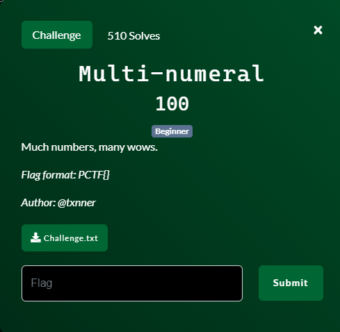
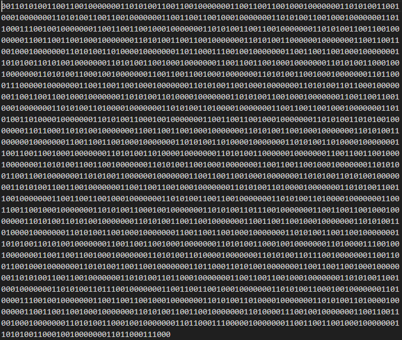
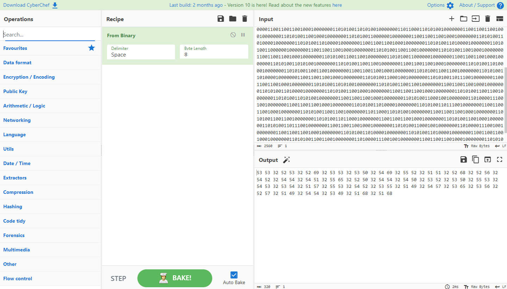
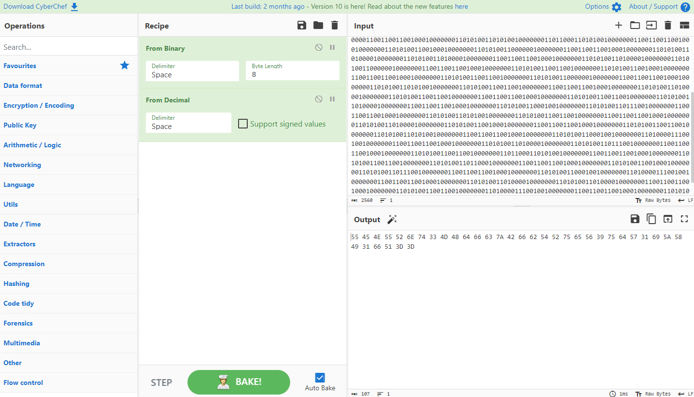
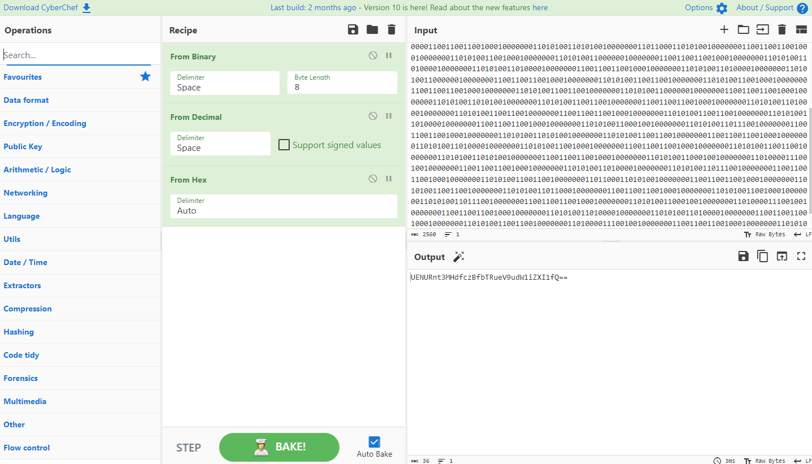
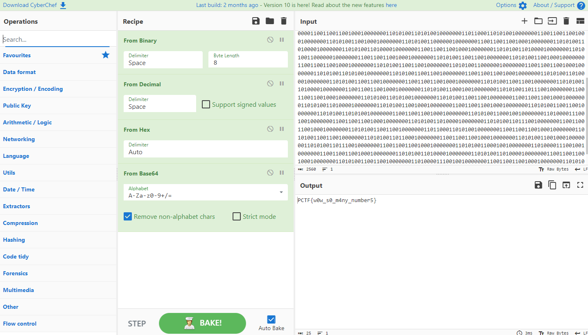

# Multi-numeral

## Files
- provided
    - Challenge.txt
- created
    - None

## Solution
Let's start by opening the provided text file and see what we are dealing with.

It is just a bunch of 0's and 1's.  My spidy senses are telling me this is binary encoded data so lets decode it.  Furtunately there is an excellent website that allows you to do a bunch of different conversions on data and chain multiple conversiong together.  That website is Cyber Chef (https://gchq.github.io/CyberChef/).

Let's go to the site, put in our 0's and 1's and select "From Binary" and see what we get.

In the output we get a bunch of numbers...not really much of a flag.  Let's chain that output with some other decoders until we get something recognizable.  After several different decoders until we end up with the "From Decimal" that produces some recognizable output.

Now that is definitely hexadecimal numbers.  Let's run it through the "From Hex" decoder.

Now that is definitely Base64 encoded data.  Let's run it through the "From Base64" decoder.

Now that output looks like a flag to me!

Challenge Complete!
