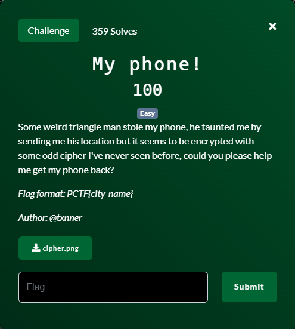
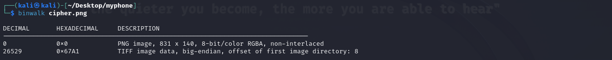
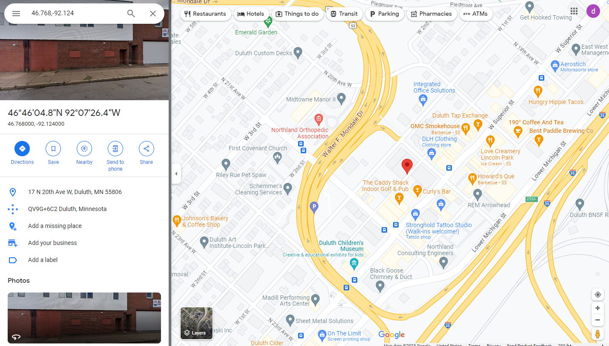
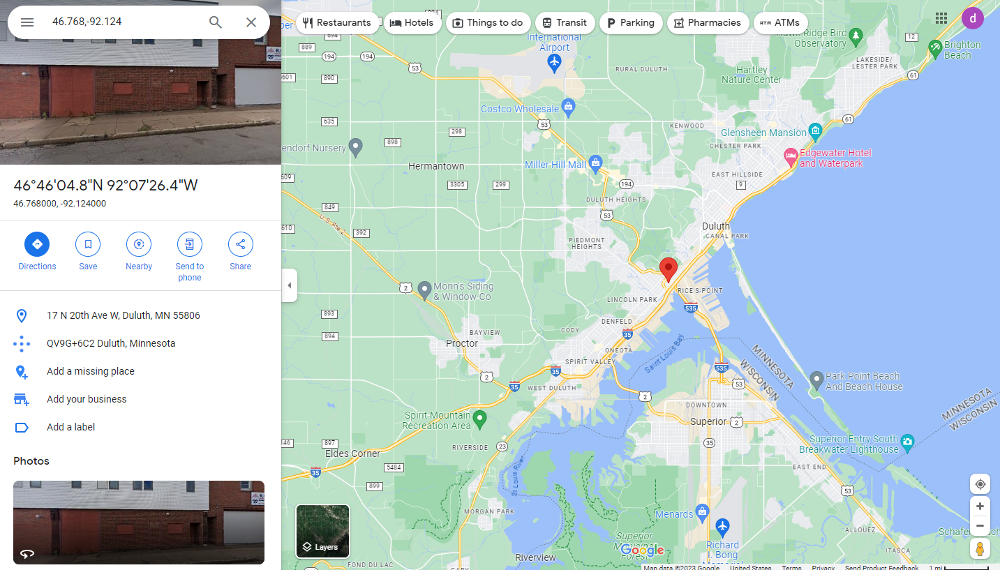

# My Phone!

## Files
- cipher.png

## Solution
My first instinct is to examine the image with binwalk to see if there are any hidden embedded files.

Nothing really of note.  While it is possible that there is something there that binwalk cannot identify, binwalk is *pretty* good at finding stuff.  Let's take a different approach and just open the image file to see what it looks like.

Ok, so this is probably some kind of heiroglyphics like alphabet where each symbol represents a letter.  If we read back to the problem description it mentions a "weird triangle man".  Maybe that is a clue to a translation for these symbols.

But I am really clueless on this one.  I don't know who is a "weird triangle man" but......

After much random internet searching for "symol cipher lists I stumble upon the Gravity Falls Bill Cipher (https://www.dcode.fr/gravity-falls-bill-cipher) that appears to have the same symbols as my message!

After inputting all the correct symbols and pressing the "DECRYPT" button we end up with the following coordinates: `46.768, -92.124` which are clearly lattitude and longitude coordinates.  Let's put those in Google Maps and see where we are.

Not really sure where this is but let's zoom out a little bit.

Duluth, Minnesota!  The problem says the flag format just contains the city.

I guess this was easier then figuring out is was COL Musturd with the candlestick in the study.

Challenge Complete!
