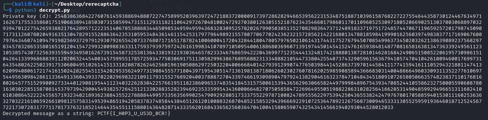

# ReReCaptcha

## Files
- provided
    - ReReCaptcha.zip
- created
    - decrypt.py

## Solution
First things first, unzip that file!

We got four files:
- CT.png

- E.png

- P.png

- Q.png

Interesting.  Three image files contain long numbers and a fourth that has some stange pictures (indeed!) along with the letter E and the number 65537.

Well if you have done some cyber things before and especially if you know much about cryptography then you know that those numbers and the names of the files point you to RSA encryption (https://en.wikipedia.org/wiki/RSA_(cryptosystem))!

TLDR: We can use the values of P, Q, and E to decrypt the encryted text (CT) into plain text (PT).

Well we cannot do this decryption with those numbers as an image...we need to make them numbers.  That sure is a lot of numbers to just look at and manually type in somewhere, and it would be very prone to error.  Let's automate converting the numbers in the image to just plain numbers in a file.  We don't use this conversion process for E.png since it really is just one short number.

So let's make a short script that will do the decryption for us....errr let's just ask ChatGPT to make the script for us!  The script is in the decrypt.py file which was almost completely created by ChatGPT.  I just set the appropriate p, q, e, and ct values from our decoded images and then sticthed two ChatGPT scripts together.

Let's run the program and see what we get.

Looks like a flag to me!

Challenge Complete!
