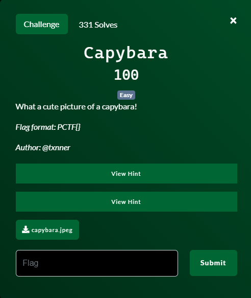
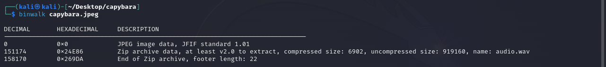
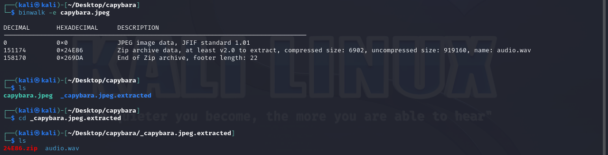
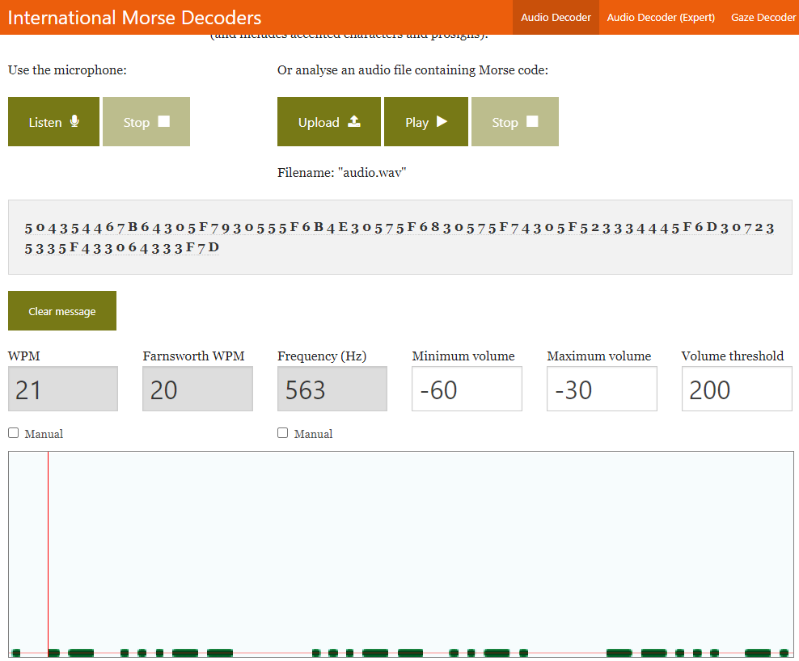
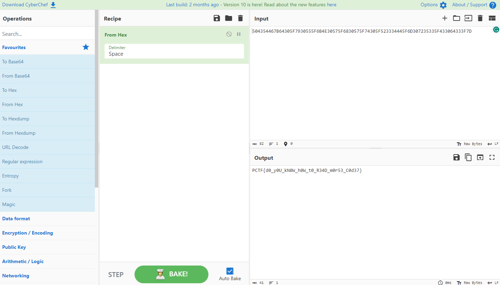

# Capybara

## Files
- provided
    - capybara.jpeg
- created
    - None

## Solution
This is a forensics challenge and all we are given is an image file.  The first thing to do in this kind of situation is check the file with `binwalk` to see if it can find any hidden embedded files.

And indeed it does.  `binwalk` has identified an embedded zip file.  Let's extract it and see what is inside!

We get out "another" zip files and an audio file.  This "new" zip file is the zip file we extracted and then binwalk went ahead and pulled out the audio file as well, so no need to unzip it manually.

So an audio file?  Let's listen to what it has to say.

Ahhhh.  The familiar beeps and dashes of Morse Code (https://en.wikipedia.org/wiki/Morse_code).  Well I do not know Morse Code but maybe if I study the Wiki page and listen to the audio slow I can figure it out.  Nah, let's not do that.  Let's find a decoder to do that for us.  Luckily I found one here https://morsecode.world/international/decoder/audio-decoder-adaptive.html.

I put in my audio file and I get the letters and numbers out in the middle of the screen.  Looks like hexidecimal to me.  Let's decode that with CyberChef (https://gchq.github.io/CyberChef/).

Challenge Complete!
