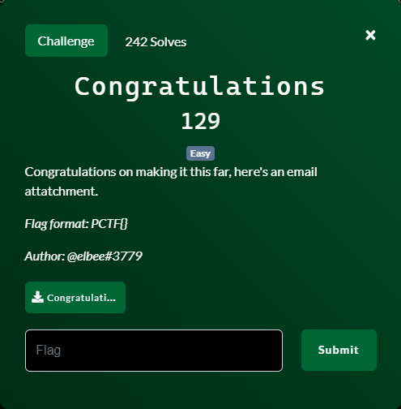
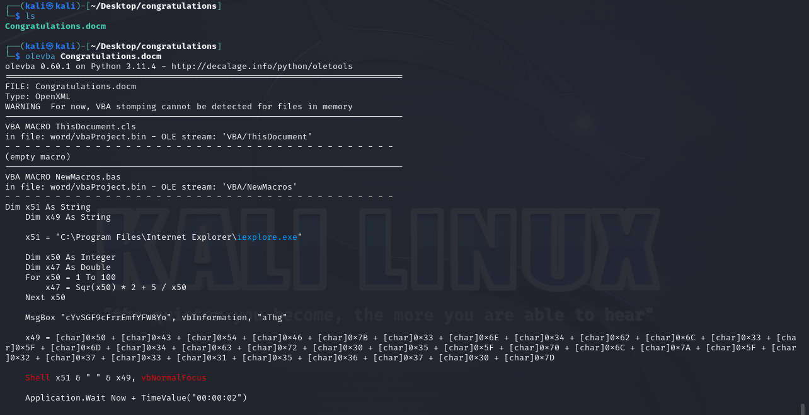
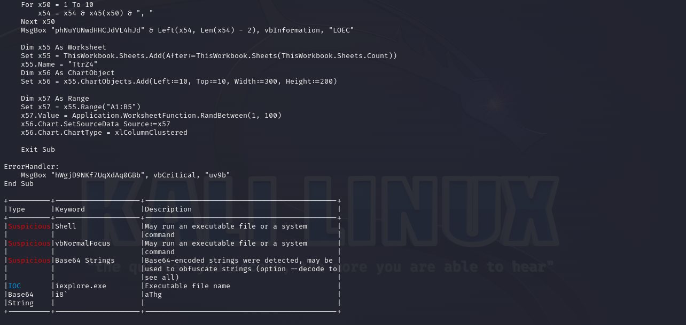
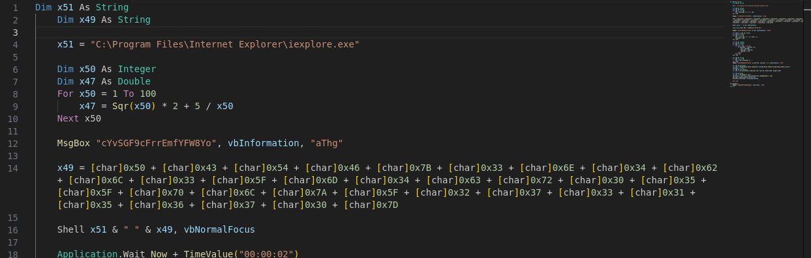
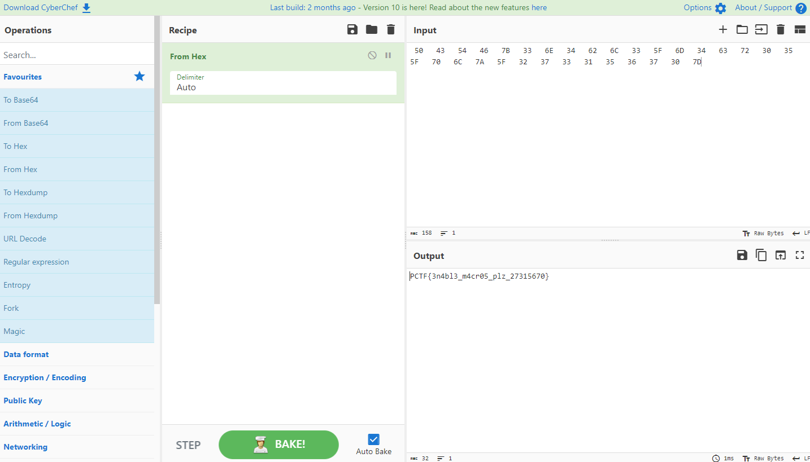

# Congratulations

## Files
- provided
    - Congratulations.docm
- created
    - None

## Solution
A Word document attachment?  A flag to find?  If there is something hidden and/or malicious in a Microsoft Office document it is almost always some kind of VBA macro.  Let's see if we can extract the macro for examination using `olevba`.

Some more stuff in between the two images....

So we clearly have a macro there and it looks like some obfuscation going on.  Let's put this into VS Code for easier manipulation.

Starting at the top of the file and working my way down:
- line 4: a string to the executable for Internet Explorer
- lines 6 - 10: Some math calculating square roots of numbers
- line 12: popping up a message box
- line 14: building a string out of individual characters.  I know my ASCII chart so I know those numbers are actual letters.  I know 0x7D is the '}' character which is what our flag format ends with.  Lets's convert all those into the actual string and see what it says.  Back to CyberChef (https://gchq.github.io/CyberChef/)

After a little formatting by removing all the [char] and '+' stuff we get some nice text after running it through the 'From Hex' decoded.  Easy peasy.

Challenge Complete!
