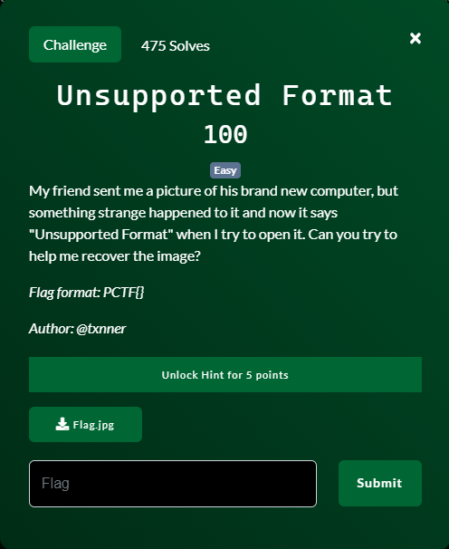
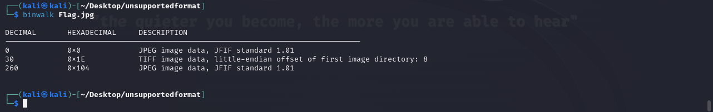
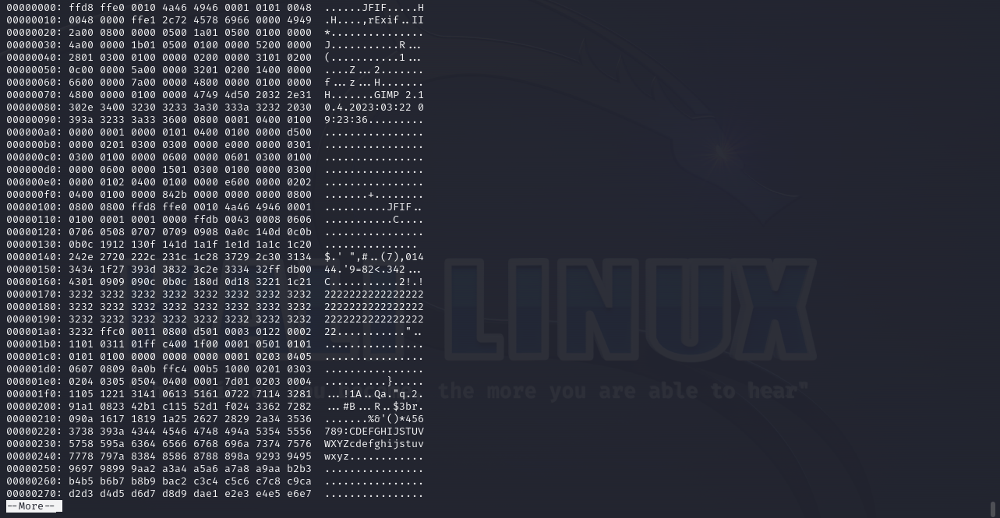
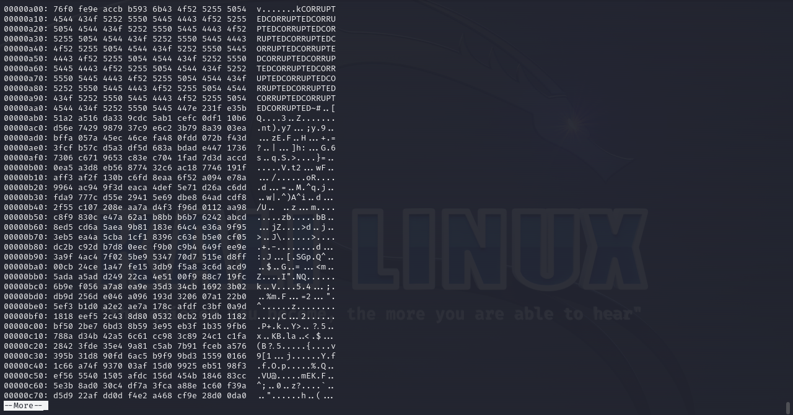
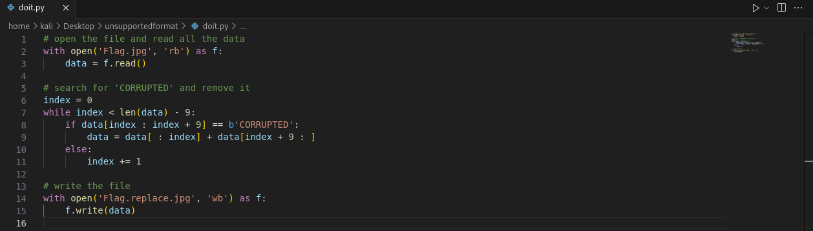
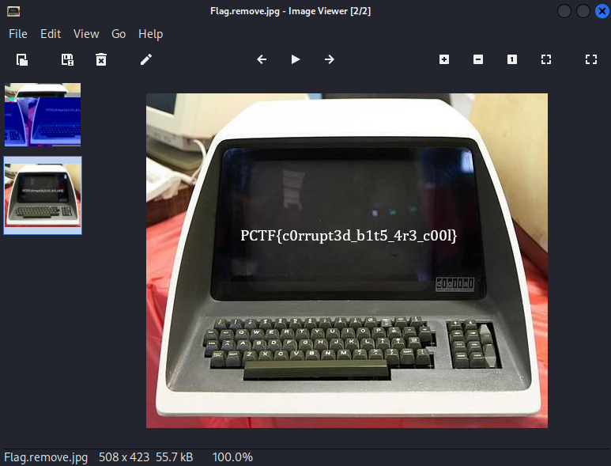

# Unsupported Format

## Files
- provided
    - Flag.jpg
- created
    - doit.py

## Solution
As with most of these challenges were we are given a file without much else information, I throw it first into `binwalk` to look for embedded files.

Sure it mentions a couple of things about some JPEGs and a TIFF, but that is really not suprising for a JPG image type.  The title of the challenge is "Unsupported Format" so maybe there is something messed up with the file format.  Let's take a look at the bytes of the file.

Doesn't look like anything too unusual in the first chunk.  We can see the "JFIF" at the top which is normal.  Now I do not have the file format memorized so there could certainly be something wrong here in the header of the file.  We will investigate that if we don't notice anything else.  Let's check the next few chunks for anything unusual.

On the 5th chunk we notice this.  A bunch of bytes representing "CORRUPTED" over and over.  Well I can tell you that certainly doesn't belong.  Maybe we can remove or replace those bytes and get a clean image.  Let's first try to just remove the "CORRUPTED" bytes and see if that helps.  Easy with python.

Let's open our generated image file and see if it makes sense.

Challenge Complete!
