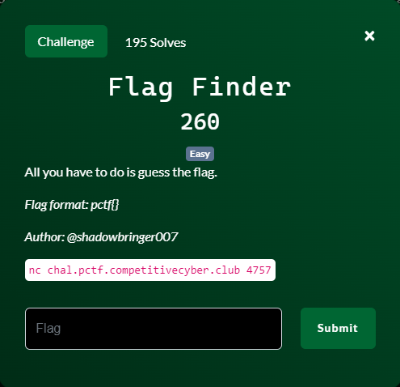
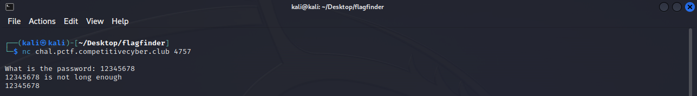
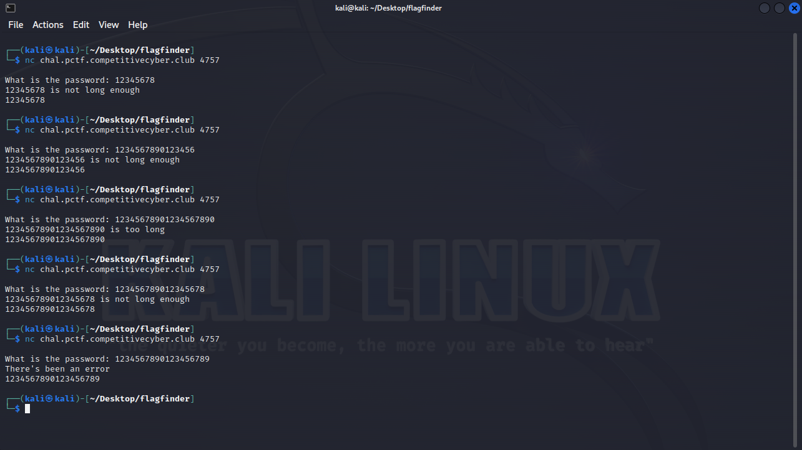
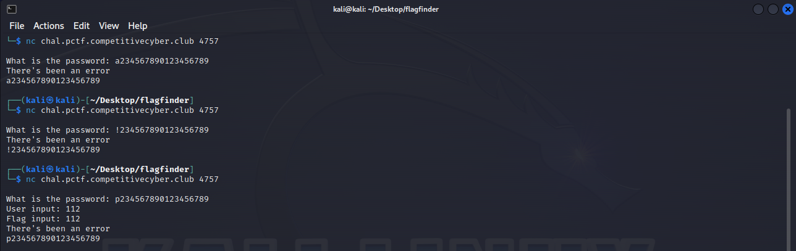
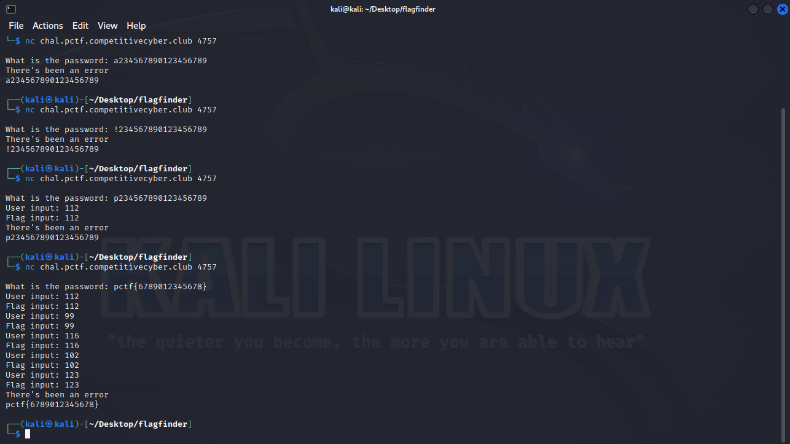
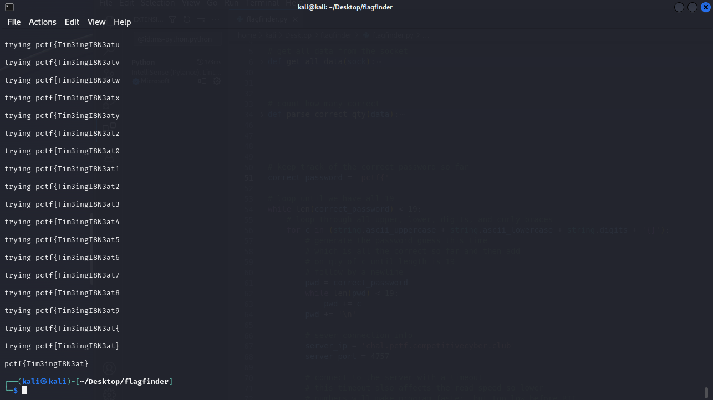

# Flag Finder



## Files
- provided
    - None
- created
    - flagfinder.py

## Solution
```
Note:  Since the server side program was not provided, you will not be able to recreate this challenge without creating your own server side program.
```

There are no other files or information provided so let's just start by connecting to the target system and see what information it gives us.


The system asks us to enter a password so we just throw some text at it and the server lets us know the password was not long enough.  That was helpful!  Let's keep trying with different lengths.


We keep trying longer passwords until the server tells us the password is too long.  Now keep trying different lengths in between like the number guessing game we played as a kid.  Finally with a length of 19 characters we get a different message.  So we now know that the password is 19 characters long.

Let's try changing the character we are guessing to see if we get a different result.


After a few tries, we have a 'p' as the first character and we get a different response.  I turns out that the ASCII code for 'p' is 112.  This makes me believe that 'p' is the correct first letter.  Since this is a CTF challenge and in the problem statement it said the flag would be of the format 'pctf{}' what happens if we follow that format with our guess?


We now have some more feedback with the ASCII codes for 'pctf{' so we must be on the right track, just that the character after the '{' is not correct.  Well we could continue to manually guess different letters for each consecutive character until we get feedback from the server of a match.....but let's automate it instead!  Below is some pseudocode and you will find the actual python file in this repo.
```
password = 'pctf{'

loop while the length of password is not 19:
    for char in allCharacters:
        guess = password + (quantity of char to pad password to 19 in length)
        send the guess to the server
        check the number of characters the server says is correct
        set password equal to the characters in guess that are correct

password is now the correct password
```

We coded it up in python and the results are the password which is also the flag!


Challenge Complete!