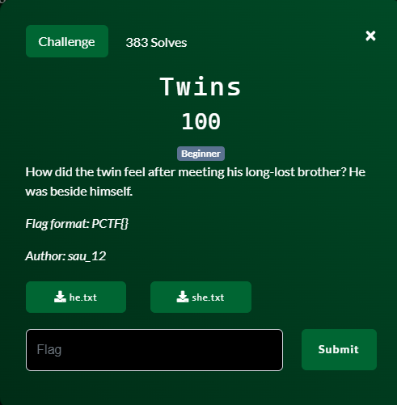
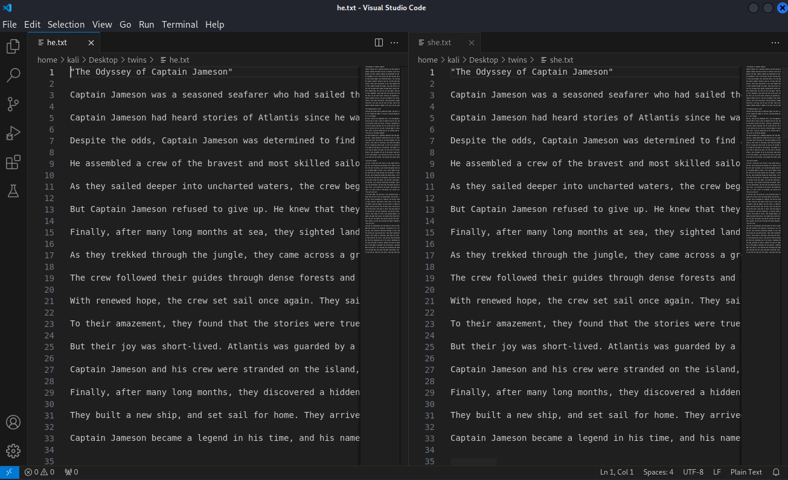
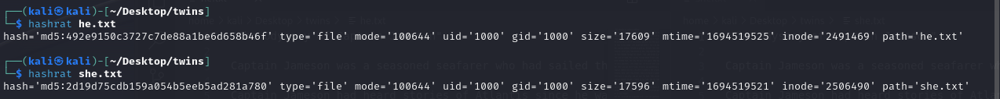
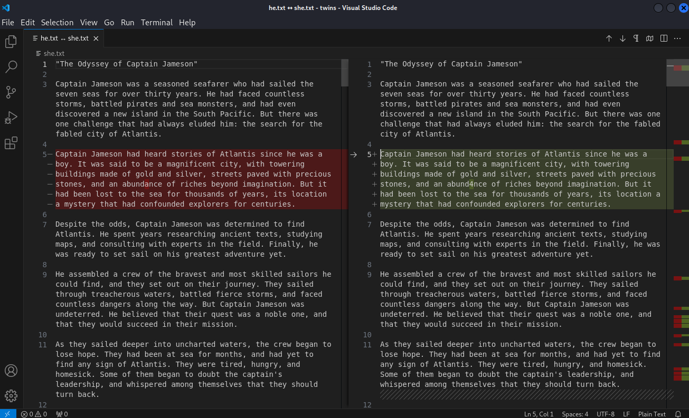
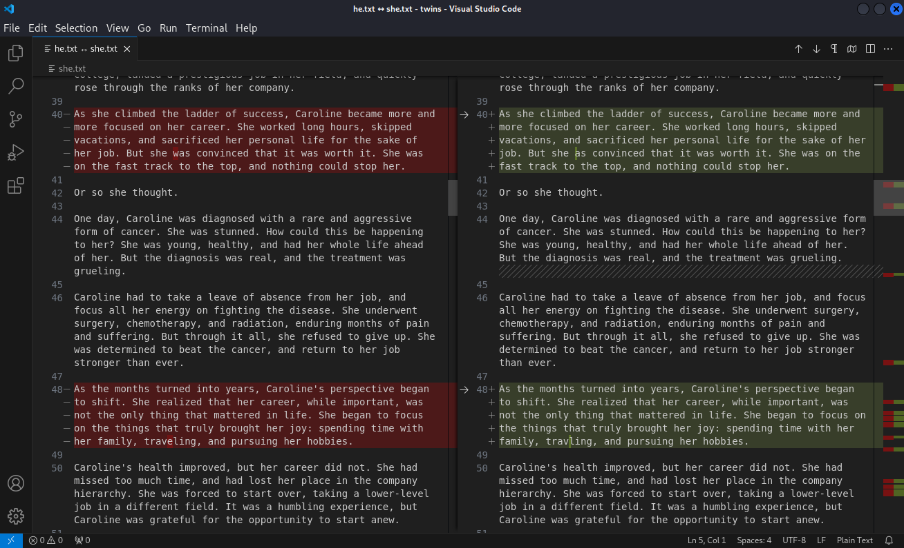
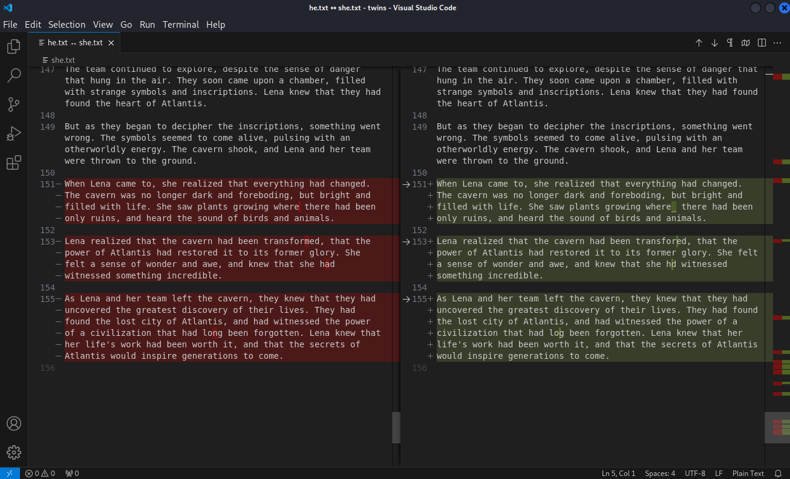

# Twins

## Files
- he.txt - text file provided as part of the challenge
- she.text - text file provided as part of the challenge

## Solution
For this challenge we are provided two files: he.txt and she.txt.

Opening these two files reveals that they are plain text files with what appears to be the same content.

We then compute the hash value of the file to determine if the content is the exact same.  It turns out the hash is different which means there is *something* different between the two files....but what?

The hashes are different!  This means there is *some* kind of difference between the two files.  Since they are just two text files we can use some software to highlight those differences.  There are many command line programs or GUI programs to highlight those differences.  I will just open up both files in VS Code and ask it to show me the differences.

The first difference is on that 5th line (I have word wrap turned on so the line number is in the left column of each file).  The spelling of the word "abundance" has changed to "abund4nce".  So we record that down as a difference and keep looking through the file.

Some more changes on lines 40 and 48.  Record it and keep going.

We keep recording differences until we get to the end of the file.  All of the letter differences add up to "4wes0M3_stories_man".  Looks like a flag to me!

Challenge Complete!
