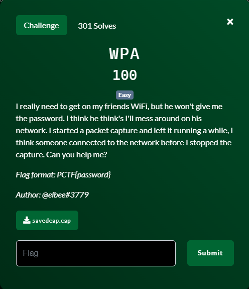
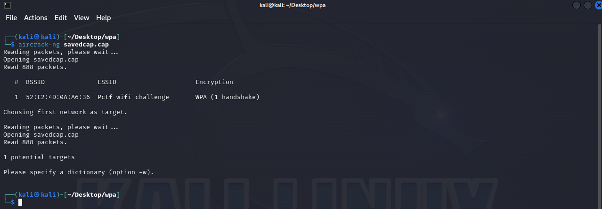
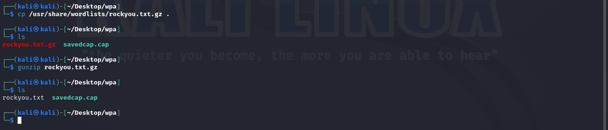
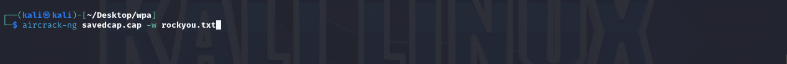
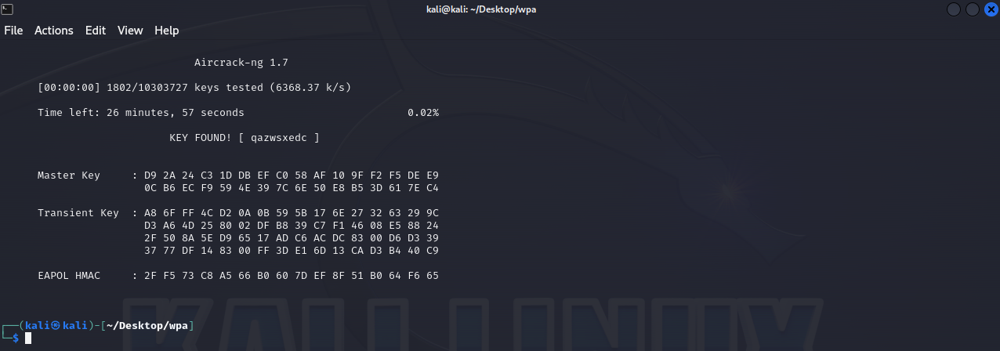

# WPA


## Files
- savedcap.cap - network packet capture data file

## Solution
For this challenge we are provided one file: savedcap.cap.

The description of the problem and the extension of the file tells me this is very likely a data file containing network traffic.  The problem states that "someone connected to the network" during the packet capture.  This is good for us.  The packet capture will contain the WiFi authentication handshake between the client machine and the WiFi network device.

We could manually comb through the PCAP file with Wireshark but why put ourself through that pain?  There is already a well known tool for parsing out the handshake and even trying to guess what the password was.  Let's get to work!

The name of the tool is aircrack-ng and it is simple to use.  We will start off by just running it against the PCAP file to make sure that it can find a WiFi handshake.


Aircrack-ng does find a handshake and identifies that it is using WPA encryption.  We can then ask aircrack-ng to attempt to crack the password.  There are several ways we can tell aircrack-ng to do that but the simplest is with a password list file.  A password list file is a plain text file that contains realistic passwords that can be used when making password guesses.  Kali includes a password list named "rockyou.txt" so let's get this file to our working directory and unzip it.


Now lets ask aircrack-ng to try to crack the password by using the passwords in the "rockyou.txt" file.


Wait for the result....which only takes a couple of seconds....
```
Note: It only takes a few seconds because the password is found in the "rockyou.txt" file provided.  This file contains around 10.3 million passwords and it found the correct password after only 1802 tries.  The further along in the file the password is, the longer it would take.  If the password does not exist in the file at all then it would still take some time (it is indicated ~27 mins for the whole file depending on computer speed) to determine that.  Then you will need to resort to other measures such as larger password files or brute force.  Brute force is an ineffective method for cracking sufficiently long passwords.
```



We now have the WiFi password!  The problem indicates that the password is our flag so...

Challenge Complete!
