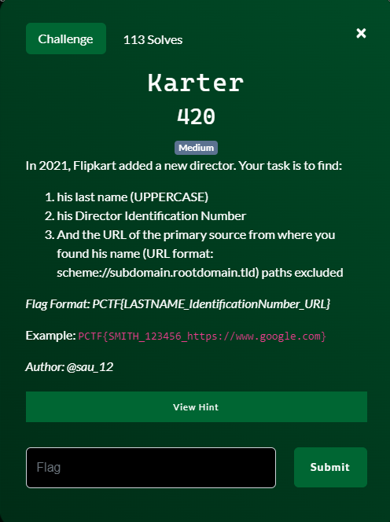
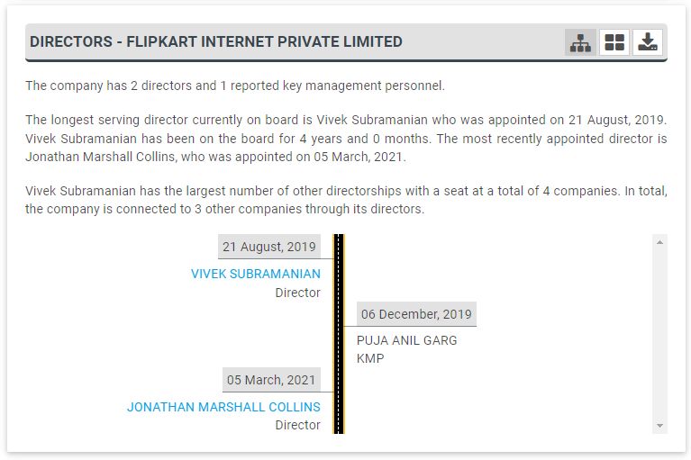
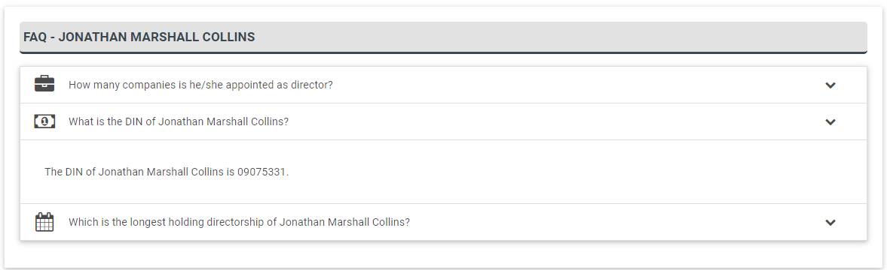
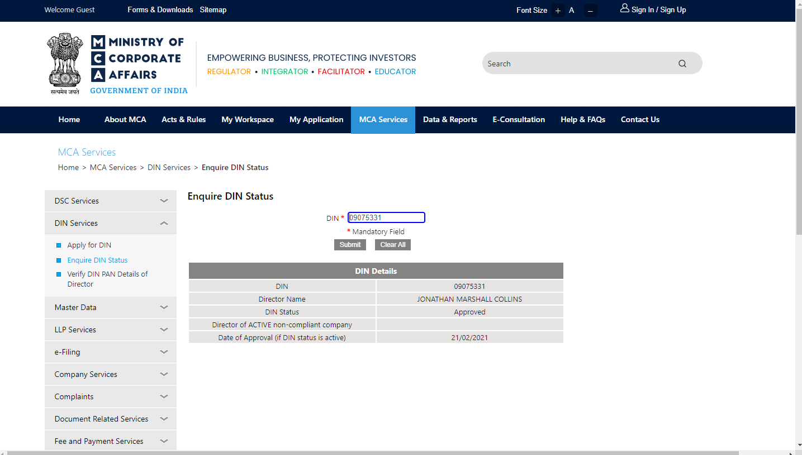

# Karter

## Files
- provided
    - None
- created
    - None

## Solution
I really didn't know how to go about starting this so I just started with an internet search on "FlipKart new director 2021" and eventually landed on this page https://www.tofler.in/flipkart-internet-private-limited/company/U51109KA2012PTC066107 which shows me there was a new director in 2021 named Jonathan Collins.

I click on the link for his name and it takes me to a page that shows his Directory Indentification Number (DIN) as 09075331.

This seems off to a good start.  Now the "primary source" website to find.  What is not seen here in the problem statement that was later put out by the event coordiantors is that the "primary source" should be a government website.  I had also noticed that FlipKart was an Indian company.  So let's try some India government websites that might have our information.  I stumble upon the website for the Ministry of Corporate Affairs.  And wouldn't you know it but that have a page to query a DIN.  Let's put in Mr. Collins DIN and ensure it comes up correctly.

Bingo.  So now we have the last name, the DIN, and the official government website.  That is all the information we need to create the flag.

Challenge Complete!
