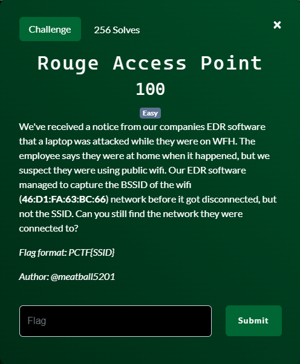
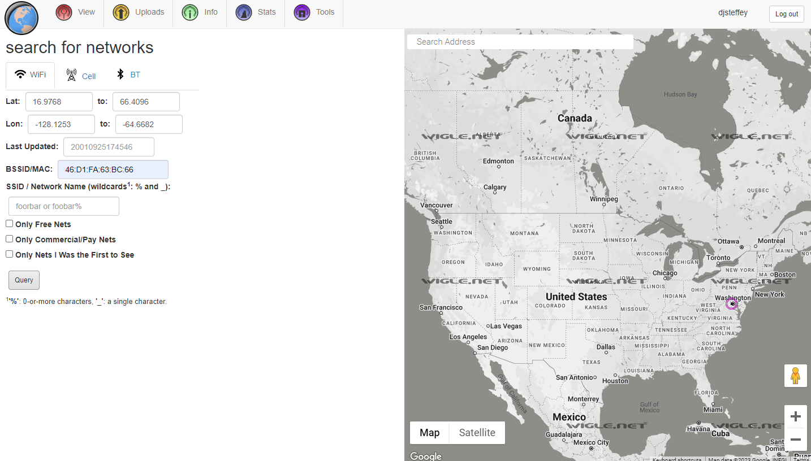
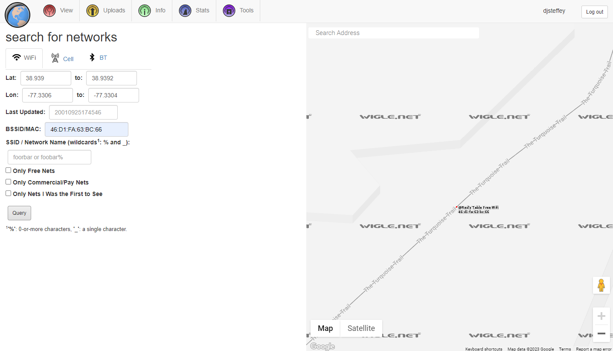
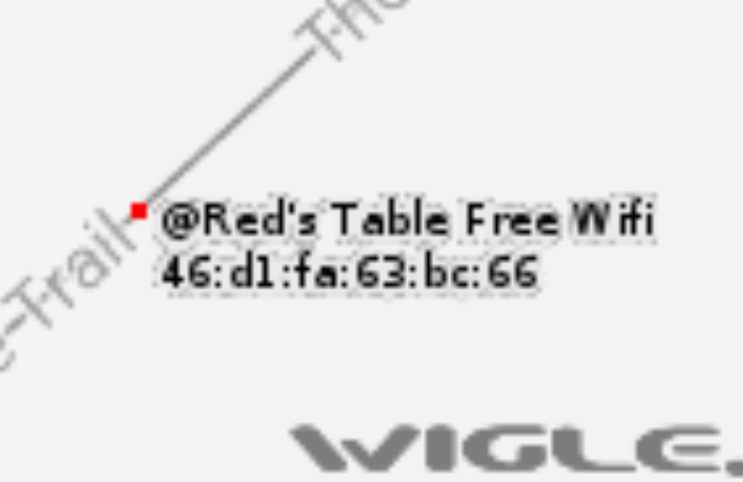

# Rogue Access Point

## Files
- provided
    - None
- created
    - None
    
## Solution
I really didn't know how to go about starting this one.  The only piece of information we have is the BSSID.  There is no hidden math or secret encoding to turn a BSSID into an SSID.

Really about the only thing that can be done is to drive all around the country with a system with a WiFi capability and see if it ever detects that BSSID.  That would take me a really long time since most WiFi signals are only good for a couple hundred meters at most.  Probably not happening in my lifetime and I just don't have the gas money to spare.

But....what if I got a whole bunch of people to do that simultaneously?  That would cut down on the work each person has to do.  What if I got a whole bunch of people to do it simultaneously over a long period of time and when they found a BSSID they upload the BSSID and its associated SSID to some database that I can query.  So let me get busy hiring some people to do that...or just look at an already established database that has been doing just that for years!  Let's go to https://wigle.net and do a search.

Searching that BSSID gives me a circle around a location somewhere in Virgina.  Let's zoom way in.

There is the location of our BSSID and the associated SSID.  Still a little hard to see.  So just like they say in tv...."Enhance!".

We got our SSID!

Challenge Complete!
