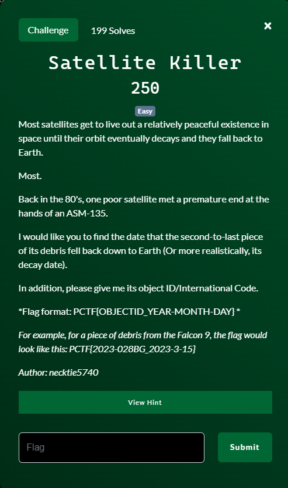
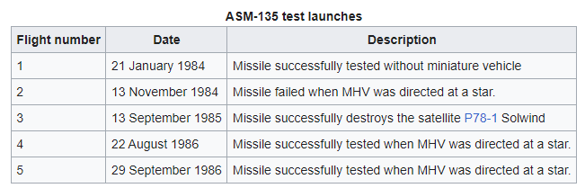
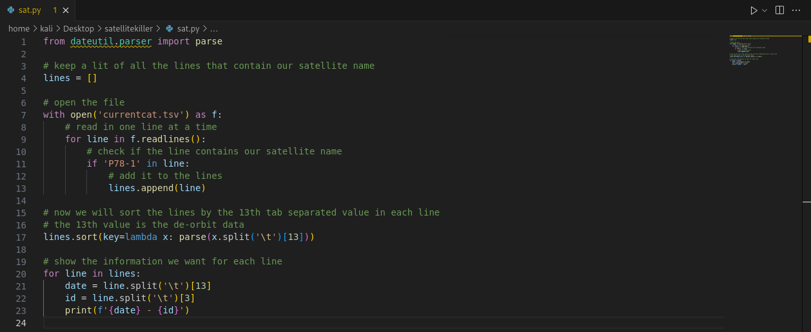
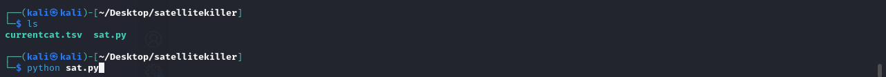
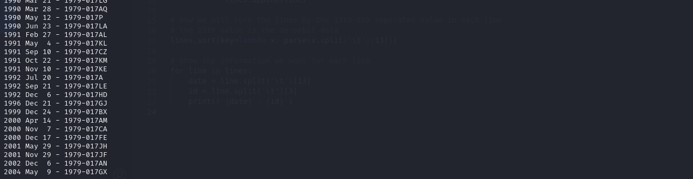

# Satellite Killer

## Files

## Solution
Ok.  First thing is to find out what satellite back the in 80's was taken out by an ASM-135 missle.  Looking at the Wiki page for the ASM-135 (https://en.wikipedia.org/wiki/ASM-135_ASAT) gives us a table that shows the satellite P78-1 Solwind was destroyed by the missle in 1985.  So far so good.

Let's look at the Wiki page for the P78-1 Solwind satellite.  Reading through the page we get information on when the final pieces de-orbited, but not when the second-to-last piece de-orbited.  Down at the bottom of the page there are several references that were used for the article.  Maybe one of those has the data we are after.

Following the #2 reference "SATCAT" take us to a page that then lists a few links for perhaps some data.  One of the data says it is a tab-separated-value file (see the currentcat.tsv file in this repo).  Sounds interesting....

Opening that file and we see 69437 lines of data.  Each line is an entry with a lot of data.  Each line represents one piece of tracked debris in space.  There is data on the satellite it originated from and the data that piece of debris de-orbited.  Exactly what we need!  Still, 69437 is way too much to search manually so python to the rescue!

We can see the the second-to-last piece de-orbited on December 6th, 2002 and its ID was 1979-017AN.  That's all we needed for the flag.

Challenge Complete!
