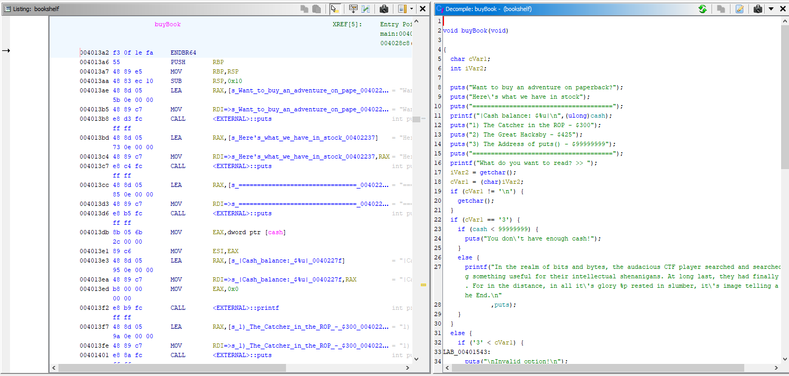
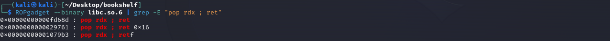

# bookshelf


## Files
- provided
    - bookshelf
    - libc.so.6 (see note below)
- created
    - flag.txt
    - doit.py
```

This vulnerability is completely reliant on the version of libc running on your system that is loaded by the bookshelf program.  The libc that was provided as part of the challenge is the libc that existed on their server system.  It is relatively unlikely it is the same version running on your system you are testing with, since you will act as the server also.

So if you want to live test this on your system, replace the libc library here with the one from your test system.  To find it on your test system execute the following command: `ldd ./bookshelf` while in the same directory as the bookshelf program.  You should get a line that tells you libc.so.6 => file location.  Copy that file to your bookshelf directory and use that file for the rest of the solution.  This will also mean that when we discuss offsets in the libc library from puts to other areas, my numbers may differ from yours due to different libc versions.
```


## Solution
```
Note:  The bookshelf executable is running on a remote server that we connect to via netcat as shown in the problem.  The executable that was running on the remote server has a file named flag.txt that contains the actual text of the flag.  We need to somehow read that file.  Fortunately, we were also provided with the executable that we could examine and test locally.

Note: This writeup assumes you understand the stack, how variables and parameters live on the stack, and how the return address lives on the stack.
```

Let's start by opening the bookshelf file in Ghidra.


The general outline of things here is
- call banner
- call menu
- get a character input
- depending on the input we will call adminBook, writeBook, or buyBook
- keep looping back up to menu until we select exit

Let's take a look at each of those functions

### adminBook


We first check the parameter if it is 0.  If so then we return.  If it is not 0 then we can put some input into the local_38 buffer.  Hey!  The buffer has a size of 48 bytes but fgets is letting us put up to 256 bytes into it!  Stack buffer overflow here we come!

### writeBook


We can decide if it is an audio book.  If it is an audio book then we set the beginning of that parameter buffer to some values.  We then input some data and if it was an audio book then we concat it to the buffer else we just copy it to the buffer.  Can we overrun the parameter buffer?  First let's look back to main where we called this function to see how big the buffer is.  Look at line 29 in main.  This is where we call writeBook and give it that mainbuffer_43 as a parameters.  This buffer can hold up to 43 characters.  Back to writeBook function.  So if we answer 'y' to audio then the first 6 bytes are going to be filled on lines 17 - 19.  We then input up to 40 characters with fgets on line 22 into a different buffer.  Since we answer 'y' to audio, then we concat to that buffer that already has 6 characters in it.  So we can put up to 46 characters into this 43 byte size buffer.  So we can overflow this buffer that resides on the stack in main.

### buyBook

```
Note: The entire contents of buyBook are not shown in this screenshot as it was too long.  Open the file in Ghidra to see the entire contents.  I will still describe what happens in the rest of the function.
```

We first get a list of books we can buy and input which book we want.  Depending on our selection, the program checks if we have enough money (the cash variable which is a global variable).  If we do have enough money, then our cash is subtracted and we are given the printout of the book.  Then we are asked to give a tip wether we had the money to buy a book or not.  If we give a tip then 10 is subtracted from the cash.

For two of the books it seems like it just may be hints, however for book 3, it will give us the address of the puts function.  This is a function inside the libc library (which we were also given a copy).  This can help us find out where in memory this function is loaded.

One problem though is that we start out with only 500 in cash as show in main on line 11.  So how can we buy these other books?

### Solution TLDR
- We will buy books and give tips subtracting from our cash.  Because our cash is unsigned it has no concept of numbers below 0.  Once our cash is subtracted and *would* go negative, the value wraps back around to the maximum value of an int which is around 4.2 billion.  That's lots of cash and will let us buy what we want.
- Now we will go buy book #3 and get the address of the puts function.  Write that address down.
- Now we will chose to write a book from main menu and select 'y' for audio and enter 38 characters and press enter.  This will set the "admin mode" flag that is checked in the adminBook function
- Now we will chose adminBook from main menu.  We will enter 56 random characters which will overflow the buffer and get us to the return address for adminBook.  We will then write additional carefully selected characters to execute a return oriented programming (ROP) chain to eventually call execve to execute /bin/sh on the remote server.  This essentially will give us command line access to the remote server and we can enter any command we want.  We will hunt for the flag at that point which is just located in a file.

### Solution: the long version
#### Get some positive cash to get the address of puts
Because the cash variable is an unsigned integer it has no concept of negative values.  If you try to subtract away from it to a negative value, it will wrap around and get up near the maximum value for an unsigned interger which is somewhere around 4.2 billion.  Our cash starts at 500 so we just need to buy books and give tips until our cash turns positive.


We select to buy a book and see that we have $500.
We have bought the second book and given a tip.  We go back to buy another book and we can see we are down to $65.  Not enough to buy another book, but we can still give a tip and keep going down to below 0, which then wraps to a large number.  We can then buy book 3 and get the address of puts.  Note that the libc library containing that function can be loaded just about anywhere in memory and this value will change from one execution of the program to another.  This is why we must use this method everytime we run the program to get the puts address.


#### Enable admin mode
Let's use the main menu option #3 to call the adminBook function.  Note in the main menu it shows a (0) there.  This is an indication we have not yet enabled admin mode, but let's try anyway.


Of course it tells us we can't because we are not an admin.  Look back at the code for the adminBook function and line 7 is where the check is done if we are an admin.  It is actually the value passed in as param_1.  Let's go back to main to see if we can make this a value other than 0 so it thinks we are an admin.

Looking back at the main function we call adminBook on line 24 and the parameter passed in is local_c.  We set the value of local_c to 0 on line 10 and no where else do we change its value.  But there has to be a way!

Well local_c is a variable on the stack and it comes after mainbuffer_43 and local_d.  So if we were to visualize what this looks like in memory we would have something like this.


So if we can overflow the mainbuffer_43 we can overwrite the value of local_c (and local_d).  There is no input into mainbuffer_43 in main but it is passed as a parameter to the writeBook function.  Let's look there.

We are asked if this is an audio book and then we are asked to write the book.  If we follow the flow of the code, we can answer 'y' to the audio book question and then enter in 38 characters for writing the book which will overflow the buffer enough to set local_c to something other than 0.

This is because that param_1_buffer_43_from_main is that same mainbuffer_43 in main that is 43 bytes in size.  So when we select 'y' for the audio book, the first 6 characters are written to that buffer on lines 17 - 20.  Then we enter in 38 characters that go into local_38 buffer on line 22 as 39 characters.  39 because of the newline that is picked up because of the enter key.  Then since we already answered 'y' to the audio book question, we will execute the strcat on line 24 which will concatenate the buffer_43 and the local_38.  buffer_43 already has 6 characters in it and local_38 has 39 characters in it.  When we concatenate this puts 45 characters into the buffer_43 that is only supposed to hold 43 characters.  When we look back up at our memory layout above, 45 characters fills up the mainbuffer_43, overwrite local_d, and overwrites a portion of local_c.  A portion is all we need though.  Just anything to make it not 0.  We are now an admin and can do something in the adminBook function.


#### Setup a ROP chain to call execve
Now the harder part begins...but not too much harder.  Here is the adminBook function again.


We have a buffer overflow here.  We have a local_38 buffer than can hold up to 48 characters.  However, on line 15 we are getting user input for up to 256 characters.  So we have a stack buffer overflow vulnerability.

There are a few possibilities of things we could do.  The two most common are to execute some shellcode to do anything we want or to setup a ROP chain to call some other existing functions of our choosing.

The shellcode option has become significantly less viable with operating system improvements such as marking the stack as non-executable.

ROP chain doesn't have this weakness but you do generally need to know at least one address in the library file that contains the function you want to call.  This is because of Address Space Layout Randomization (ASLR) meaning things will not always be in the same location in memory.  But if you know the address of *something* in the target library, then you can just calculate the offset to the address of what you want to call.

Fortunately for us, we have a method of getting the address of puts in the libc library.  So with that address known (which will change each time you run the program), we can calculate the address of the execve function and call it.

So to execute a ROP chain we have to put certain values onto the stack, which we can do with our overflow.  However, what values and where?  At the point of input in adminBook the call stack will look like this.  The second column is the address offset from the local_38 buffer since that is the buffer we will overflow.  The goal is to overwrite the buffer to the return address at 0x0038 (and beyond) to build a ROP chain.


The goal is to call execve.  So let's look up that function and what it's parameters are.


It takes 3 parameters:
| parameter | meaning |
|---|---|
| const char* filename| pointer to the executable to start |
| char* const argv[] | command line parameters to that executable |
| char* const envp[] | environment variables |

The linux method of passing parameters on a 64-bit system are setting the parameters into registers in this order: RDI, RSI, RDX, RCX, R8, and R9.  If there are more than that then they are put on the stack.  So if we want to start "/bin/sh" then we need to set RDI to the memory location of a string with that value, RSI to 0, and RDX to 0.  We then call the memory location of execve and....magic!!!

So how do we do that?  We have been given a copy of the libc library.  There are lots of strings and assembly instructions in that file.  Let's see how to use information from that file to get this done.

First, let's set RDI to "/bin/sh".  Let's see if that string exists in the libc library.  Looking at the library in Ghidra, we see it does have that string at memory location 0x29604f.  Now remember that the address can change once it is loaded into memory.  We will cross that bridge later.  For now, let's just write down that address for the string.


Now we need a way to put that value into RDI.  An easy instruction to do that in the context of a ROP chain is with the asm instruction "pop RDI".  What we need to do is find a combination of "pop rdi" followed by "ret".  This will pop a value off the stack into RDI and then return.  Since we will control the stack we can control what value is popped off it.  The return will then pop an address off the stack and go to it.  Since we control the stack we control were it goes after that.  So let's find a "pop rdi ; ret".  We can use the linux command `ROPGadget` in combination with `grep` to search a binary file for the instruction we want.


We have found a perfect candidate at address 0x27c65.  Now to make this line up with our addresses in Ghidra we will add 0x100000.  This is because Ghidra, by default, assumes a base *offset* address of 0x100000 and applies that to all the addresses.  ROPGadget does not.  Since we are going to use the ROPgadget addresses to compute offsets from Ghidra addresses, we need to get them all to the same base.  So this gadget address now becomes 0x127c65.  Again, it can change but write down that address for now and that it is for setting rdi.

Now lets find something to set RSI to 0.  We found it at address 0x29419 and with base offset is 0x129419.  Write it down.


Now lets find something to set RDX to 0.  We found it at address 0xfd68d and with base offset is 0x1fd68d.  Write it down.


The last thing we need is the address of the execve function that we want to call.  Let's find it in Ghidra.  We find it at address 0x1d4060.


So let's see how we setup all these address on this stack with our overflow to get the intended execution.  We need to overwrite the local_38 buffer to set the values in the following diagram (almost).


When we get to the end of the adminBook function the following steps will occur:
- pop off the return address and instead of going back to main, it will go to the pop rdi gadget
- that gadget will pop off the next item which is the address to the "bin/sh" string and store it in rdi and then return
- that return will pop off the next item and go to the pop rsi gadget
- that gadget will pop off the next item which is 0 and store it in rsi and then return
- that return will pop off the next item and go to the pop rdx gadget
- that gadget will pop off the next item which is 0 and store it in rdx and then return
- that return will pop off the next item and got to that address which is the address for execve
- since we have the appropriate registers set with the appropriate values, we should get a shell that we can enter standard linux commands into

Now...I said this was *almost* the right values.  If the libc library was loaded into memory at the same addresses shown in Ghidra then this would work right away.  Unfortunately, that is not the case because of ASLR.  However, if we know *any* address in the library when it is in memory then we can use offsets to get the address of what we really want.  The offset in the file in Ghidra will be the same offset when the file is loaded in memory.  Fortunately, we have already covered how we get the address to the puts function.  So now we need to compute each of those addresses offset from puts.
| What | Address in Ghidra | Offset from puts |
|---|---|---|
| "/bin/sh" | 0x29604f | +0x12054f |
| pop rdi gadget | 0x127c65 | -0x4de9b |
| pop rsi gadget | 0x129419 | -0x4c6e7 |
| pop rdx gadget | 0x1fd68d | +0x87b8d |
| execve | 0x1d4060 | +0x5e560 |
| puts | 0x175b00 | ---|

Applying these offsets to our previous stack illustation.


#### Putting the pieces together
- buy books and tip until money wraps around positive
- buy the 3rd book to get the address for puts
- write an audio book that has 38 characters to set admin mode
- calculate the actual addresses need for the ROP chain based on the address of puts and the offsets
- write an admin book that has 56 characters that we dont care followed by the appropriate bytes to setup the ROP chain as shown in the previous table

We will need to code the solution to execute these steps.  I choose python.  Why can't we hard code the input as we did for other challenges?  The problem with that is calculating addresses from the offset from puts.  Can't hard code those values because we don't know ahead of time where puts will be.

We will have our python script connect to the server and send the correct inputs to get the value of puts.  It will listen for the address of puts, and then compute the offsets.  It will then send the correct inputs to enable admin mode.  It will then send the correct inputs to overflow the buffer and setup the ROP chain.  We will then have a shell to the remote system and can issue any command we like.

Refer to the commented python script to execute the vulnerability.

#### Execution
- Setup our own server since the CTF server is no longer running.  We set the input and output buffers to be 0 so that the sending and receiving of data to and from our python script is faster and unbuffered.  We set netcat in listen mode on port 4444 and piping it's input and output to the bookshelf executable.  This effectively lets our python script interact with the bookshelf program over the network.  Even though this is on the local system, it doesn't have to be.  The server machine can be anywhere in the world that we have a network path to.


- Execute the python script and wait for the command prompt.


- They python script sends all the appropriate commands to the server to setup and execute the ROP chain.  We will then end up at a prompt to execute any command we like on the remote server.  We list the current directory.  See there is a flag.txt file and get its contents.


Refer to the python script for full details on how it does the job.

Challenge Complete!
