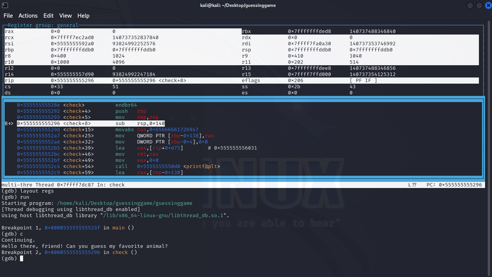

# guessinggame


## Files
- provided
    guessinggame
- created
    flag.txt

## Solution
```
Note:  The guessinggame executable is running on a remote server that we connect to via netcat as shown in the problem.  The executeable that was running on the remote server has a file named flag.txt that contains the actual text of the flag.  The program on the server will read it and send it to us....if we can make it.  Fortunately, we were also provided with the executable that we could examine and test locally.  We just need to also create our own local test flag.txt that the executable can read
```

Let's start by executing the file.


Well it is not a dog!  Too bad.  Time to open the executable in Ghidra.  As always let's start in main.


Not much going on here.  It first prints something out and then calls a check function.  The interesting stuff must be in there.  Let's look at that function.


So generally speaking there is some printing going on, input from the user with the gets function, and some comparisons to see if we got the correct animal.

If we look closly though, the *name* of the animal doesn't much really matter.  The quantity of characters in the name does matter.  Here is why.

On line 13 our user input goes into the buffer called local_138.  It is compared on line 14.  If the compare is true then it just prints "That's not my favorite animal...".  If it is false, then it prints "ERRR! Wrong!".  So the content is irrelevant.  What is interesting is that if local_c is not 0 then we print something and call the outputFlag function.  Let's look at that function real fast.


We can see that it just reads in a flag.txt file and then prints out the contents of that file which presumably is the actual flag.  You may ask "why dont we just open that file locally and see it?".  Well remember that this executable is *actually* running on a remote server.  That is the one we interact with.  And the flag.txt file exists on that remote server.  So we don't have direct access to it.

So, we need someway to convine the check function to call this outputFlag function.  Let's go back.


What can we control?  We can control the user input which gets put into the local_138 buffer.  But local_c is the variable that determines if the outputFlag function is called or not (line 21).  The value of local_c is explicity set to 0 (line 11).  How can we change that value?  And the answer is with a classic buffer overflow (https://en.wikipedia.org/wiki/Buffer_overflow).

First we need to visualize what those local variables look like in memory.  The variables live on the stack (https://en.wikipedia.org/wiki/Stack_(abstract_data_type)).  It is essentially a sequential area of memory where local variables are stored (and other stuff which is a story for another day).  Below is the layout in memory of the local variables for this check function.


So local_138 is what our user input goes into but local_c is what we need to change.  The local_138 variable has enough room in memory for 300 bytes.  What happens if we type in input that is *longer* than 300 bytes?  Well we would start filling up the memory *after* local_138 which is the memory for local_c.  We do have to be careful not to go beyond that, at least not for this exploit.  Other exploits (particularly ROP) would do that, but not here or now.  That is a story for another day.

So normally programmers would prevent you from inputing more data then you are supposed to.  However, these programmers were not so good.  The gets function (line 13) they are using to get the user input provides no such restrictions.  The gets function will get as much data as you type in...forever...or at least until you hit the enter key.

So we need to enter enough input to go past the limits for local_138 and overwrite local_c, but not so far as to go beyond local_c.  Since the local_138 buffer is 300 bytes, and local_c is immediately after it, we just need to put in between 301 and 304 bytes to change the value of local_c.  A reminder that one of those bytes will automatically be the `null` character at the end of what we type so leave room for it.

So let's execute the program again and try different amount of input.  We have also created out own fake flag.txt file so that the program locally has something to read.  Let's run the program in gdb so we can watch the memory get overwritten.  We start the program under gdb, use the gdb commands to set the disassmebly output into intel format, and set breakpoints on the main and check functions.  We then use the gdb command to show the disassembly.


We then give the gdb command to show the registers and then start running the program.  We immediate stop at the breakpoint in main.  There isn't too much we want to do here because the vulnerability is in the check function.  Since we already set a breakpoint on the check function, we can issue the continue command to go to the next breakpoint.


We are now at the start of the check function.  You can see along the way that we printed the "Hello there..." output.  Now lets find the instruction that does the compare from line 21 of the source code to determine if we show the flag.  We can use the arrow keys to scroll through the assembly and see that at the 0x555555555315 address is the compare.  So let's set a breakpoint there as well, and then issue the continue command so the program will keep running until it gets there.


You can see that along the way the program asked for our input and we just entered some dummy characters for now.  Now we are at the part of the program where is is comparing the local_c value to 0 to determine if we show the flag.  If it is NOT 0 then it will show the flag.  Let's look at the memory to see what the value of it is right now.


In the first command we find the value of $RBP which is 0x7fffffffddb0 and we have seen that local_c is at $RBP-0x04 which would be 0x7fffffffddac.  In the second command we show the memory area around $RBP.  The memory for local_c is the upper half of the value on the right side of the first line.  It shows 0x00000000 which is to be expected.  We expect that value to be 0 because we have not overwritten it yet.  Let's restart the program and this time put in more input to get close to local_c, but not over yet.  This time we put in 299 characters.


And now lets see that same memory area.


A *little* different this time.  What is it?  local_c is still 0x00000000 but the other stuff on that same line looks like a pattern.  It is the pattern of characters that we typed in ending with '789' which are the bytes 0x37, 0x38, and 0x39 which we see on that right side of the first line right next to local_c.  Let's restart the program and add just 2 more characters....


Now we can see that we have overwritten the value of local_c.  Now when the check is done from line 21 of the source code in Ghidra, that if statement will be true and it will execute the function to output the flag.  Let's go!


Challenge Complete!


