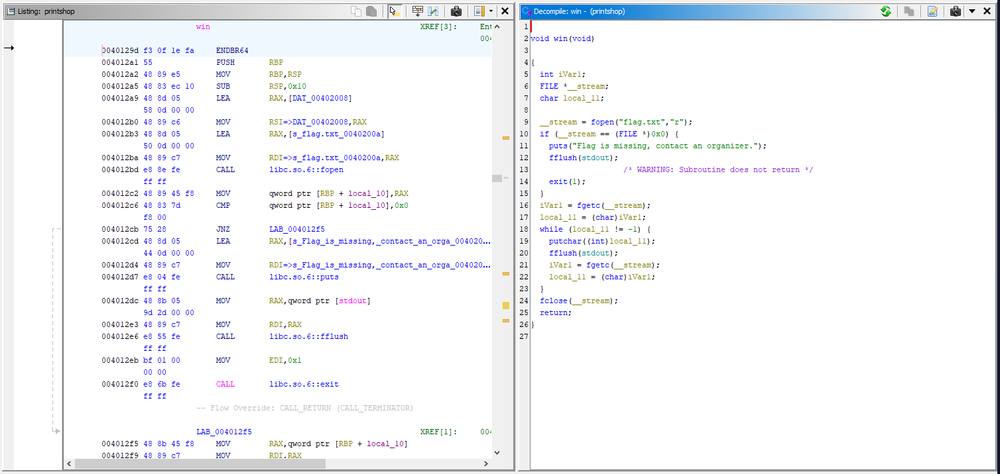
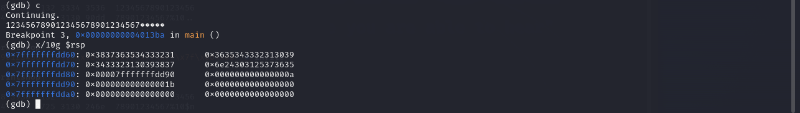

# printshop


## Files
- provided
    - printshop
- created
    - infile
    - flag.txt

## Solution
```
Note:  The printshop executable is running on a remote server that we connect to via netcat as shown in the problem.  The executeable that was running on the remote server has a file named flag.txt that contains the actual text of the flag.  The program on the server will read it and send it to us....if we can make it.  Fortunately, we were also provided with the executable that we could examine and test locally.  We just need to also create our own local test flag.txt that the executable can read.
```

Let's start by executing the file.


It asks us what we want to print.  I enter some input and it and it prints it out.  Seems pretty simple.  To Ghidra!


Here is the main function.  Not much going on here.  Just some input and output.  No sign of anything related to a flag.  I was thinking there might be a buffer overflow vulnerability here but it turns out to not be the case.  The user input goes into the local_78 buffer which is 104 bytes in size.  The programmer did use fgets to restrict the input to 100 characters so not enough to cause an overflow.  Let's see what other functions are in this program.


We have a function called win that does what we want it to.  It loads the flag file and then prints out the flag!  But looking back at main, this function is never called.  How can we get it to execute?  Let's look back at the main function again.


On line 12 it takes my input and on line 14 it just prints my input.  No checks or validation on what my input was.  I was a little stumped at first but a co-worker of mine gave me a tap in the right direction.  The vulnerability is called a Format String Vulnerability.  I will not got into the inner workings of how this vulnerability works in general or why it is exploitable.  You can find a good writeup and practice environment here (https://github.com/Caesurus/how2fsb/tree/master/playground) and a very good writeup with illustations here (https://www.securecoding.com/blog/format-string-vulnerability/).

TLDR: We can use this format string vulnerability to do an arbitrary read and arbitrary write on the stack.  We will use that arbitray write capability to call the win function from main when it instead tries to call the exit function.

We start by running the program and finding out how many stack parameters away our format string is.


We can see our format string is the 6th item on the stack as that is where the pattern of characters we typed in starts.  Instead of typing out all the "%p"s to get there, let's shorten it down.


Again, we confirm it is the 6th item and now we can use a number to specify which stack item to deal with instead of using lots of "%p"s.  Let's run it in GDB and observe the memory in preparation for attempting a write operation.  We set a breakpoint on main, right before the call to printf, and right after the call to printf.  The latter two so we can see the change in memory.


We run the program and use "abcd%6$p" as the input and let it get to the breakpoint after the print.  We see the print is our string.  Let's examine the stack memory to make sure.


Ok but why is it now the *first* stack item?  When the manipulation of stack is taking place we are *inside* the printf function, but when we are showing the memory contents now it is *after* that function and back in main.  When we go into the printf function the stack gets offset a certain amount, 6 items in this case, and when we come back it is reset.  This is why we specify 6 in our string for the 6th stack item.  All further mentions of the number of the stack item is in reference to when it is inside the printf since that is where all the magic happens.

Now, let's try to write a number into the memory address 0x7fffffffdd90.  To do that, we need to write that memory address to somewhere else on the stack.  Let's write that address to 0x7fffffffdd80.  That memorry address is the 10th on the stack.  So we can write to that 10th item by just putting in enough input to get there.  It starts at 32 bytes after the beginning of our format string.  Let's just give it a longer format string and see we can write there.  We will use the string "1234567890123456789012345678901234567890".  The first 32 characters will go into stack items 6 - 9.  Characters 33-40 will go into stack item 10.  Let's check the memory now.


We can see the pattern of all those characters we type in.  Now instead of that final "34567890" at the end of the format string, we need to type in the characters to turn the bytes into 0x7fffffffdd90 instead.  But those bytes don't map to ASCII characters so we cant exactly type them in, we need to put them into a file and then redirect it as the input.  Let's first make the file.


We can see we now have our desired input bytes in the file.  Let's run the program again in gdb and use this file as our input.  Then let's examine the memory to see what we have.


Indeed we have written that memory address 0x7fffffffdd90 into memory at 0x7fffffffdd80 which again is stack item 10.  So now if we use a format string to write to the memory address at the 10th stack item, we will write a value into the memory at 0x7fffffffdd90.  Let's change up our input a little bit to fit in the write specifier.  We are keeping the string the same length so we don't mess up the stack item the memory address is written to.  We just insert a "%10$n" as a replacement for some of the characters.


Let's run it and check memory.


Now we have written the value 0x1b to our target memory address!  What does that represent?  That is the number of characters before the write instruction in the format string.  So we had "123456789012345678901234567" *before* the write portion of the format string.  How many characters is that?  0x1b characters.  One more shortcut before we get the the actual exploit to get the flag.  What if we want to write a big number? Like 400000?  Going by what we have done so far we would need to write 400000 characters then then write instruction.  That is a lot.  We can use one more printf trick to write an arbitrary number of characters with a short format string.  We can include "%400000c" somewhere in the format string that will cause it to print 400000 spaces.  This counts towards that number of characters written that it will write to our target memory address.

Putting it all together.  So if we can write an arbitrary number to an arbitrary memory location how do we get the program to call win instead of exit.  There is the concept of the Global Offset Table or GOT and the PLT (https://en.wikipedia.org/wiki/Global_Offset_Table).  When our program wants to call a library function, we essentially have a function pointer to the actual library function.  The exit function we are actually calling is a library function.  Let's look at the call of that function in gdb.  Here we can see it resolves to 0x401160.


Let's look at the PLT for exit in Ghidra.


We can see it is at memory address 0x404060 which through a couple levels of indirection calls the real exit function.  But what if we change the value in that memory address to point to our win function instead of exit?  When the program tries to call exit...it will actually call win.  The address of our win function is 0x40129d.  So if we can write 0x40129d to the memory location 0x404060 we win!

Let's first work on just being able to write the value 0x40129d to a location that we control.  Let's write it to that same 0x7fffffffdd90 address we were writing a smaller number before.


Let's run it and look at the memory.


So we do get a value *close* to 0x40129d written to our target memory address.  It is a little off because there are some pad characters at the beginning of our format string.  We must subtract off that count of the characters from the print spaces instruction to account for those.  Let's change the input, run it again, and look at the memory.


Bingo!  Now we can write the address for the win function into that 0x7fffffffdd90 memory address.  But now we need to write it into the exit function PLT memory location at 0x404060 to redirect exit to call win instead.


Run it and pray!


We can see the correct address at the 10th stack location.  And we can see the contents of the 0x404060 memory point to the win function!  We can now just run through the rest of the program in GDB or just run it from the command line and get the flag because our win function will now be called.


We end up with a segfault...not that important because we executed the function we wanted and got the flag anyway.

Challenge Complete!