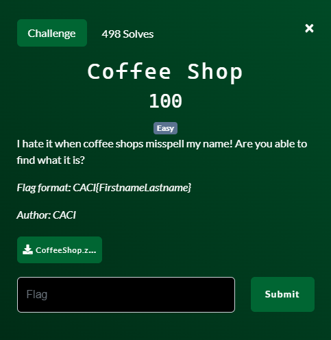
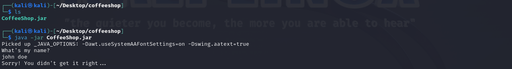
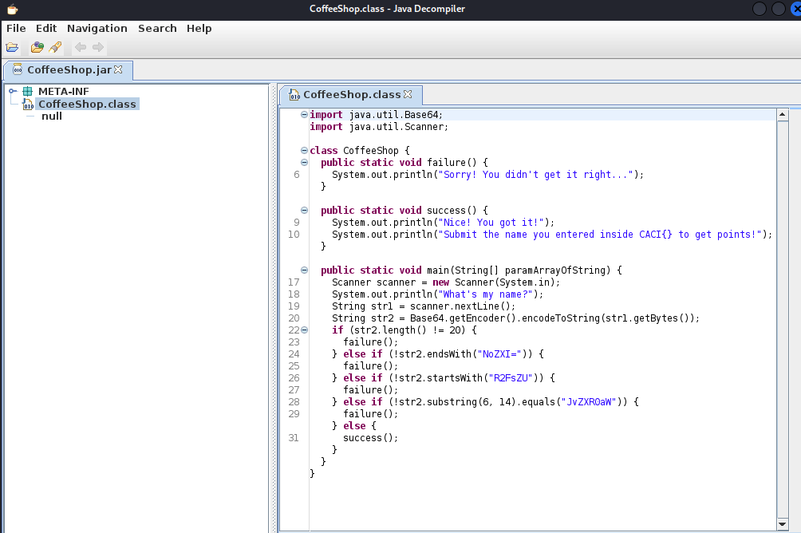
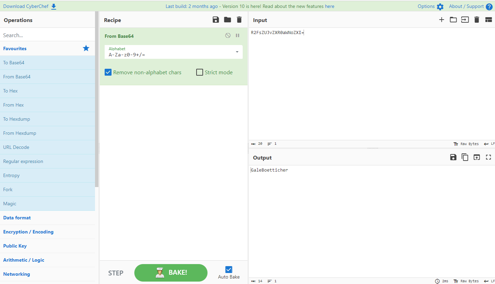
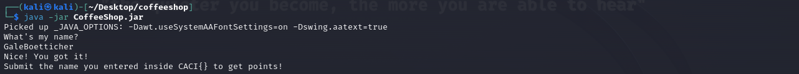

# Coffee Shop

## Files
- provided
    - CoffeeShop.zip
- created
    - None

## Solution
Let's start by unzipping the provided file and we get a CoffeeShop.jar file.  A jar file is just some compiled Java code.  Let's run the program and see what happens.

It just asks us for our name.  I enter in a generic name and get a response that I didn't guess it right.  How many names are there in the world?  A lot.  A LOT!  So just randomly guessing names is off the table.  If only there was a way to look at the source code of the compiled Java program....there is!  We can open the file with `jd-gui CoffeeShop.jar` and let it do it's magic.

Let's break down some important lines:
- line 17: the start of the program inside the main function
- line 18: it will print to the screen "What's my name?"
- line 19: let the user type in the guess of the name
- line 20: base64 encoded that input and save as the variable str2
- lines 22-28 are checking the following of the *encoded* data:
    - length is 20 characters
    - ends with "NoZXI="
    - starts with "R2FsZU"
    - middle section is "JvZXR0aW"

So it is just making sure that the base64 encoding of what you type in matches a certain string.  Lucky for us base64 encoding easily goes in both directions.  So let's take the "answer" and base64 decode it.  Back to Cyber Chef (https://gchq.github.io/CyberChef/).

There is the name.  Let's rerun the program to make sure it is accepted.

Challenge Complete!
