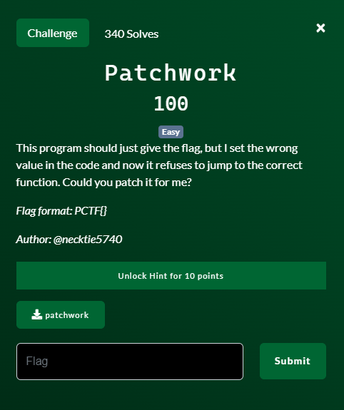
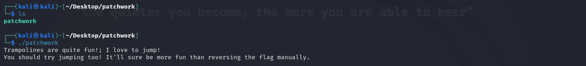
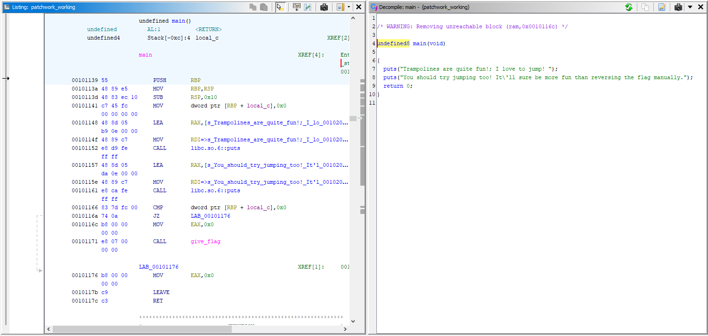
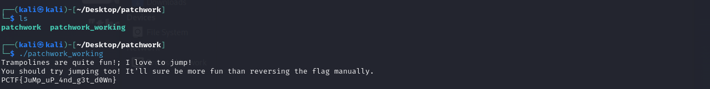

# Patchwork

## Files
- patchwork

## Solution
Let's start by running the program to see what happens.

Not much going on there.  It mentions a trampoline which is a reverse engineering and exploit term.  The name of the challenge is "patchwork" so I will propbably need to patch the file.  And the problem says "I set the wrong value in the code and now it refuses to jump to the correct function".

So we are going to need to examine the code for this program, figure out where the "wrong value" is and modify the program so it is correct.  Time to open the file in Ghidra (https://ghidra-sre.org/).

On the left is the assembly instructions for the program and on the right is Ghidra's best effort at what the source code *may* have been.  It is not perfect but Ghidra does a pretty good job at it.

If we look only at the source code we see it prints a couple of things and then ends the program.  However, if we look at the assembly on the left there is more going on.  Here are the key points:
- address 00101141: puts the value 0x00 into the local variable local_c
- address 00101152: print out the "trampolines are quite..." string
- address 00101161: print out the "you should try..." string
- address 00101166: compares the value of local_c to the value 0x00
- address 0010116A: if they are equal then go to address 00101176 (skipping the give_flag())
- address 00101171: call the give_flag() function, which will print our flag
- address 0010117C: end the program 

So we can see when it does the comparison of local_c to 0x00, if they are not equal then we will keep going to address 00101171 and call our give_flag() function (not going to review it here) which will print our flag to the screen.

But, right at the beginning we just set local_c to 0x00 and then later compare if it is equal to 0x00.  This will always be the case because we never change it any other way.  So let's actually edit the bytes of the file so that we set local_c to anything else except 0x00.

By merely changing the value to 0x01 instead, we can now see the decompilation on the right will include the function call to give_flag().  So let's save this change and then run our program again and see if we get the flag.

Challenge Complete!
