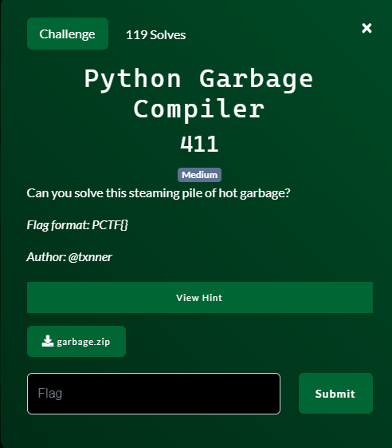
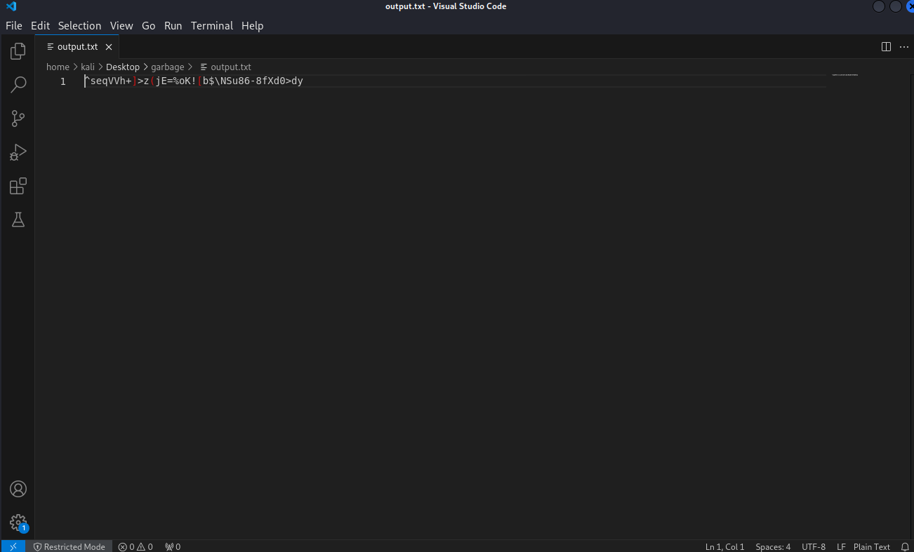
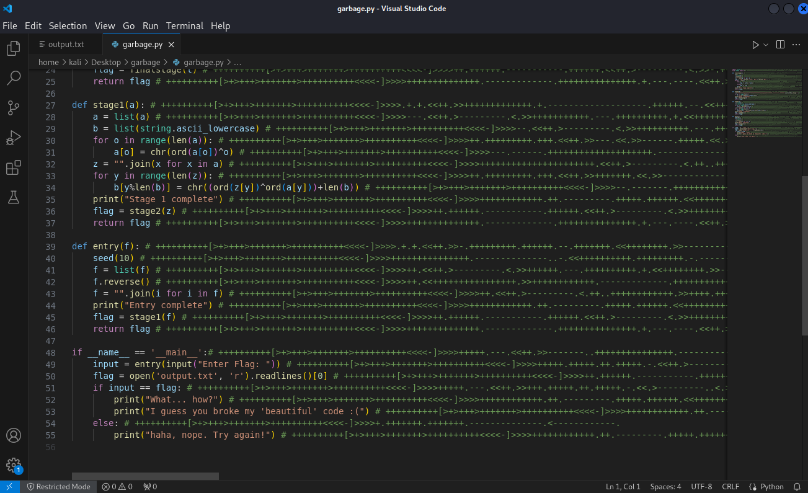
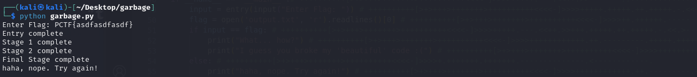
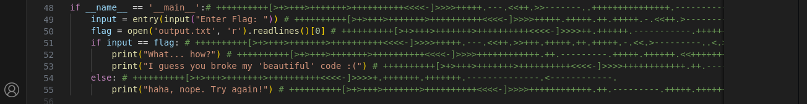
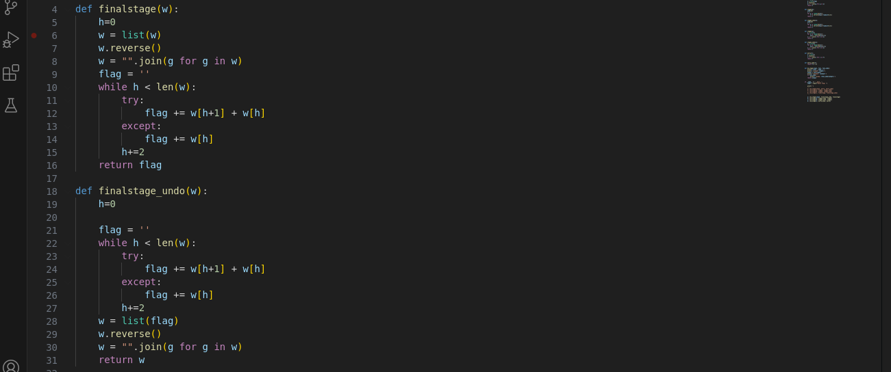
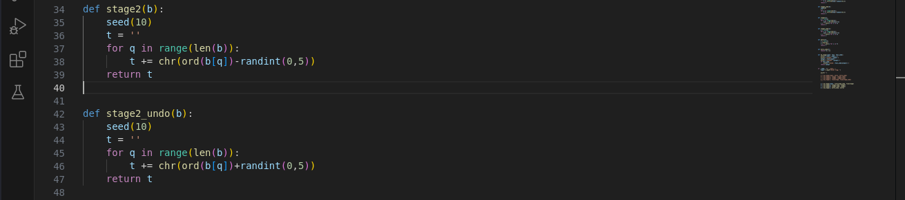
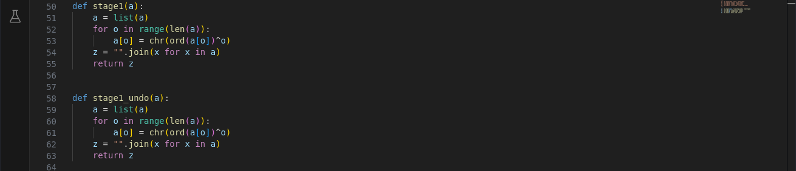
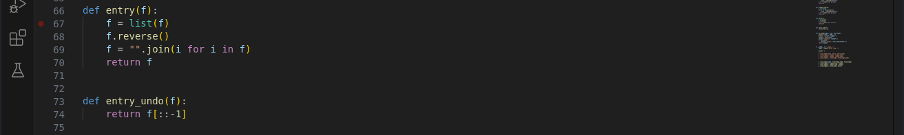
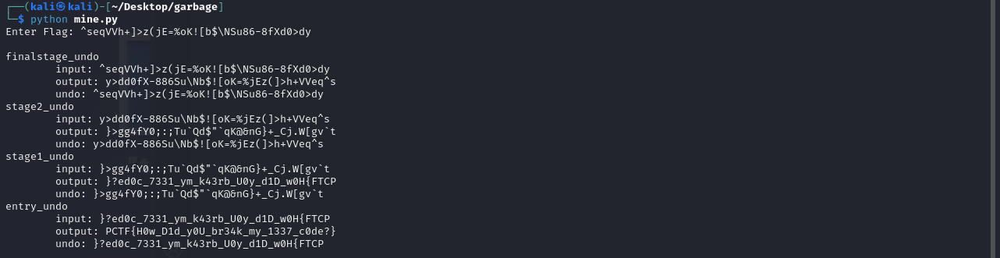

# Python Garbage Compiler


## Files
- given
    - garbage.zip
- produced
    - mine.py

## Solution
Let's start by unzipping the provided file.  We get two files, garbage.py and output.txt.  Let's look at the output.txt file first.


We get what looks like some "garbage" or encoded text.  Not much we can do with this yet so let's look at the python file.


Looking at this makes my head hurt.  It is really ugly.  But let's execute the file to see what we are dealing with.


I know the flag format so I use that and a bunch of random letters.  It goes through a few stages and then...laughs at me?  Laughs at me!?!  We will see who has the last laugh!  Looing back at the main function we can see it gets my input, puts it into the entry function, reads a flag from the output.txt file and then compares my input (after going through the entry function) to the text in the output.txt file and checks if they are the same.  If they are the same then the input was the flag.  So TLDR: my input is encoded and if they input matches the value in the output.txt file, then my original input is the correct flag.


So let's figure out how my input is encoded.  It first goes into the entry function which does some encoding and then calls the stage1 function.  The stage1 does some encoding and calls the stage2 function.  The stage2 function does some encoding and calls the finalstage function.  The finalstage function does some encoding and then returns the flag which makes its way all the way back to main as my encoded input.

TLDR: input -> entry encode -> stage1 encode -> stage2 encode -> finalstage encode -> encoded input

So if we have the encoded input (from output.txt) can we go backwards and take the encoded input and go back to plain text input?  To do so we will need how to decode at each stage and then run the stages in the reverse order.

TLDR: encoded input -> finalstage decode -> stage2 decode -> stage1 decode -> entry decode -> plain text input

But the problem is we are not provided a decode function for each stage.  So we need to analyze each stage and make our own.  Additionally all that random text after the # symbols are just comments and just distracting so I remove those.  Below we show each stage (stipped of the comments) and create an undo function for each.

### Final Stage

The normal finalstage function reverses the string and then does some math substitutions on the letters.

The undo finalstage does the substituion and then reverses it back to the original.

### Stage 2

The normal stage2 function does some math operations with random numbers to transform the characters of the string to a different character.
```
A note on random numbers:
Normally this might have been a problem because of random numbers because they should be random right?  Not really.  Random numbers (in most situations on a computer) are deterministic.  Meaning the same numbers appear in the same order.  Every time.  Imagine a really long list of numbers.  Really long.  And the order of the numbers are set but they are not in sequential order.  Meaning numbers can appear in any order, but they are always in the same order.  So if you start at the beggining and start reading them off you will get certain numbers.  If you do the same thing a weeek later and start at the beginning you will get the same exact numbers.  However, what if you choose to start somewhere that is not the beginning?  Well you would get different numbers.  That is essentially how random numbers work.  We change where to start at.  But for this program, the seed function we see is basically telling random where to start.
```

Now in our undo stage2 function, we are telling random to start in the same location so that we get the same random numbers from when the encoding tool place.  Now we apploy the opposite transformation (plus instead of the minus in the encoding) and we get out the original string.

### Stage 1

The normal stage1 function just performs an xor operation on each character.

Our undo stage1 function performs the same xor operation.  The great thing about xor is that it goes both ways. `x ^ y = z` and `z ^ y = x`.  So if we have z (encoded character) and y (the xor value) we can get back x (original character).

### Entry

The normal entry function just reverse the string and nothing else.

Our undo entry function also just reverses the string which gets it back to its original form.

### Putting it all together
Now that we have an undo function for each stage, we can take the original output, run it through each undo stage in reverse order, and we will get the input that must have been required to make that output.


We run the program and enter in the output from the output.txt file.  We have added in a couple extra print statements along the way.  At the end, the output of the entry_undo function is out flag.

Challenge Complete!
