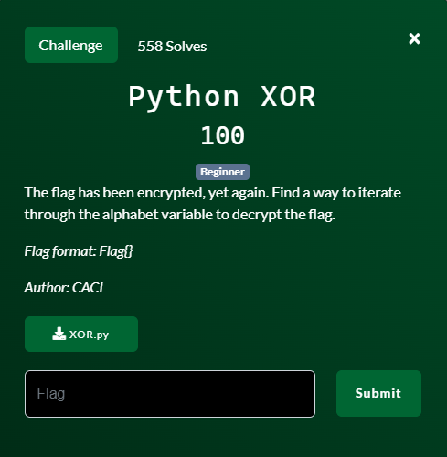
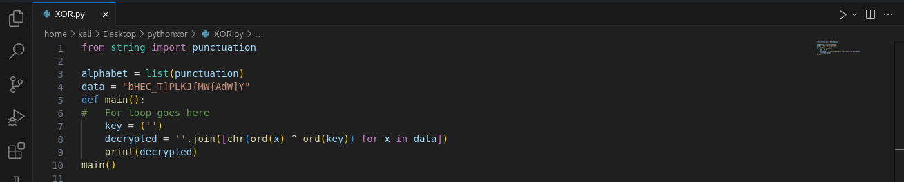
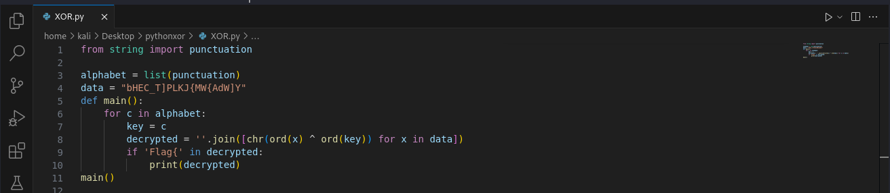
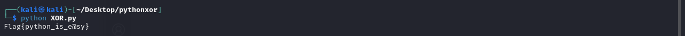

# Python XOR

## Files
- provided
    - XOR.py
- created
    - None

## Solution
This was probably the easiest problem in the CTF.

Let's take a look at the python file first.

Ok there looks like list of some characters in the alphabet variable.  We have a main function that runs.  Inside it is a key, a decrypt (xor) with that key and then a print.  Oh look!  It even tells us that we need to put a for loop there.  And the problem says "find a way to iterate through the alphabet variable to decrypt the flag".

Beyond easy.

We just added in the loop on line 6 to go through all the characters in that alphabet list.  For each of those characters we make the key equal to the character.  Decrypt with that key and then print out the decrypted string.  Now for all the strings printed, just find the one that matches the flag format.  If it matches then print it out.

Challenge Complete!
