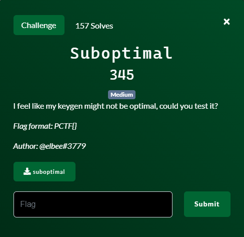
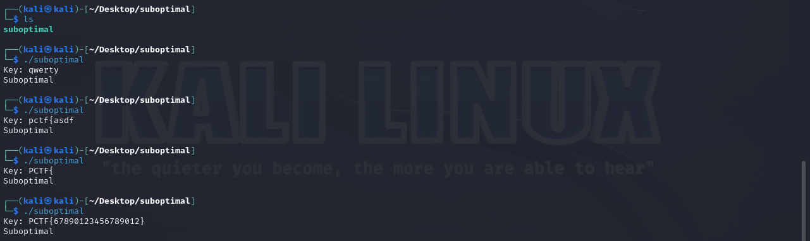
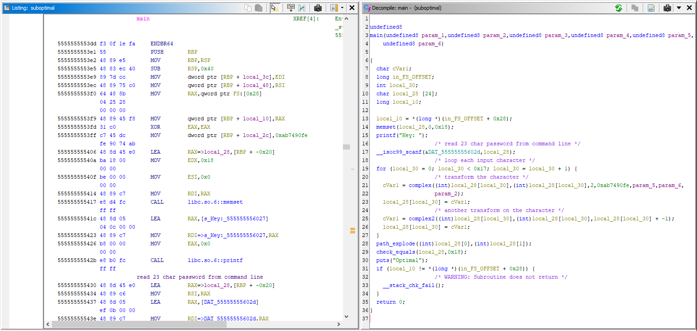
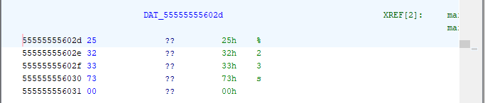
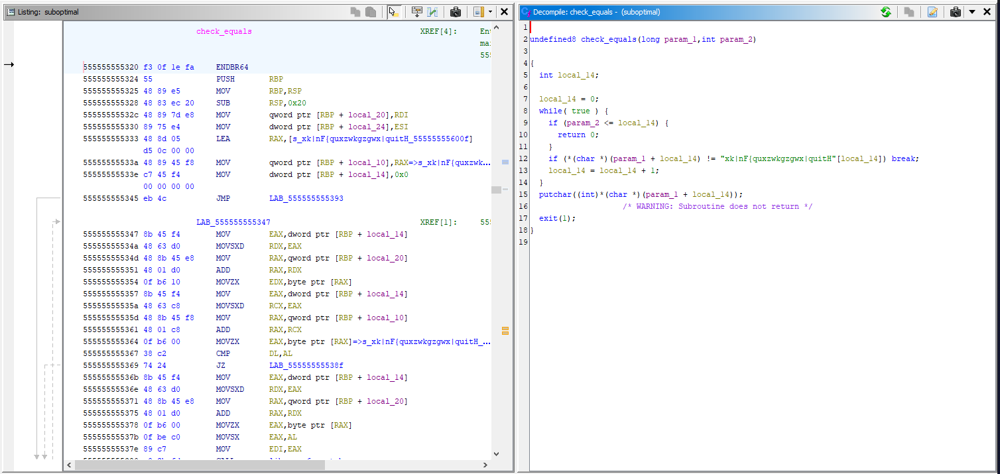
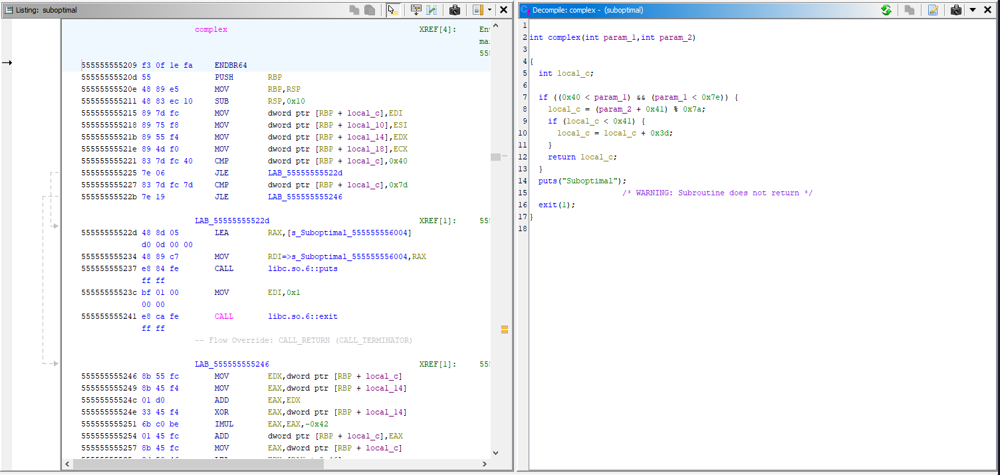
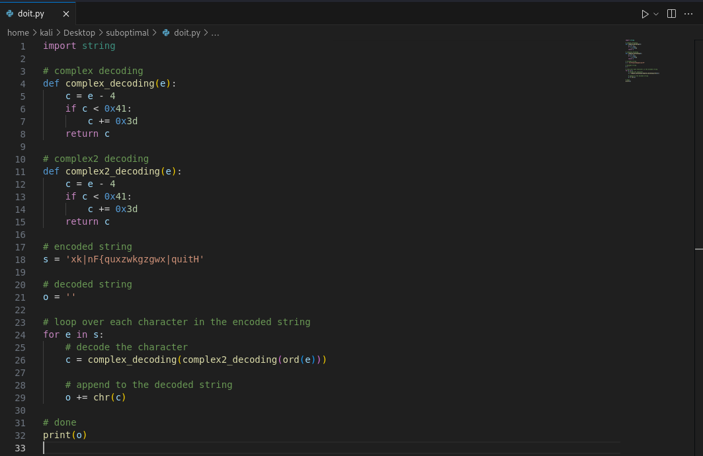
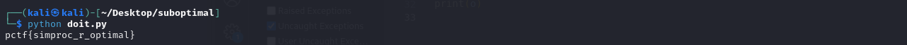

# Suboptimal


## Files
- given
    - suboptimal
- produced
    - doit.py

## Solution
Suboptimal is another compiled program.  Let's start by executing the program to see what we are dealing with.


Obviously my guesses were suboptimal.  Let's open the file in Ghidra and start examining the code.


The decompilation on the right is Ghidra's best guess as to what the original source code looked like.  It is not perfect, but it is still pretty darn good.  We can see a few things going on:
- some local variables, particularly the local_28 which holds characters (a string)
- clear out that local_28 to all 0's (0x18 of the characters)
- print out "Key: "
- get input from the keyboard into the local_28 variable
    - the string format is show below indicating 23 characters of input
    
    - there is a loop that executes 0x17 times
        - call the function copmplex on each character and then save that character back to the local_28 string
        - call the function complex2 on each character and then save that character back to the local_28 string
    - call a path_explode function with the first and second characters of the local_28 string
    - call a check_equals function with the local_28 string and the value 0x18
    - print out "Optimal"

TLDR: take my input, run each character through two encodings, checks if the encoding is a certain value, it if is then the original input is the flag

First let's find what encoded value it is checking against.  When we open the check_equals function we can see that there is a loop checking the input string (param_1) against each letter in the string shown.  If at any point a character does not match then we break from the loop and exit the program.


So, after our input characters are encoded, then they must be equal to "xk|nF{quxzwkgzgwx|quitH".  Now that we have figure that out, lets see if we can reverse the encoding.  First lets look at the complex function to see the first stage of the character encoding.


The inputs to the function (param_1 and param_2) are actually each character of the input string one at a time.  It is the same character for both parameters.  We can see this when we look at the call to this function from main.  local_28[local_30] is the first and second parameter which is an individual character from my input string.  There are a few math operations here but when we break it down to pseudocode it can be more clear:
```
if 0x40 < inputChar and inputChar 0x7e
    val = (inputChar + 0x41) % 0x7a
    if val < 0x 41:
        val += 0x3d
    return val
print 'suboptimal'
exit program
```
TLDR: the input character must be between 'A' to '}' on the ASCII chart and its value is shifted 4 places to the right.  If it goes past the end '}' then it wraps back around to 'A'.  So to undo it we just need to shift 4 places back to the left.

The complex2 function is identical expect for the initial check that the character is in the range.  By the time the code gets to complex2 then it is gauranteed to be in the range anyway because that is the range that complex produces.

I create a python script to do each of the complex and complex2 decodings and then feed the encoded string through it to get the original string which is the flag.


Winner winner chicken dinner.


Challenge Complete!