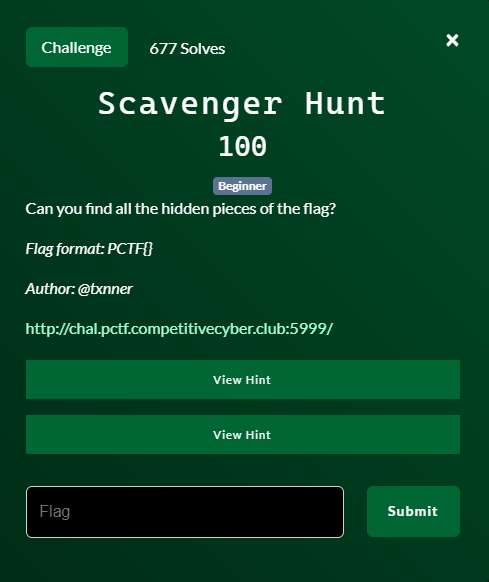
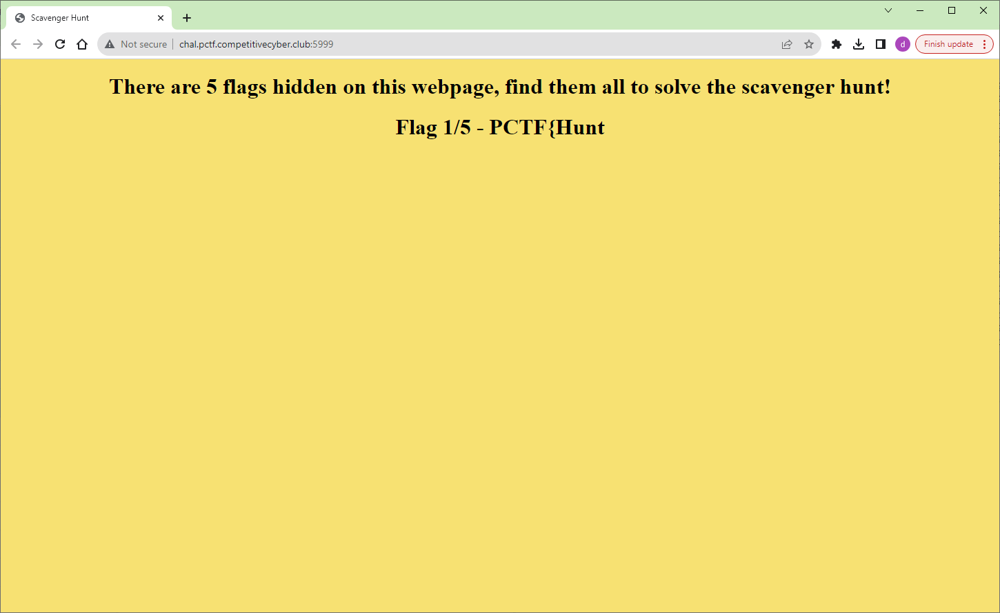
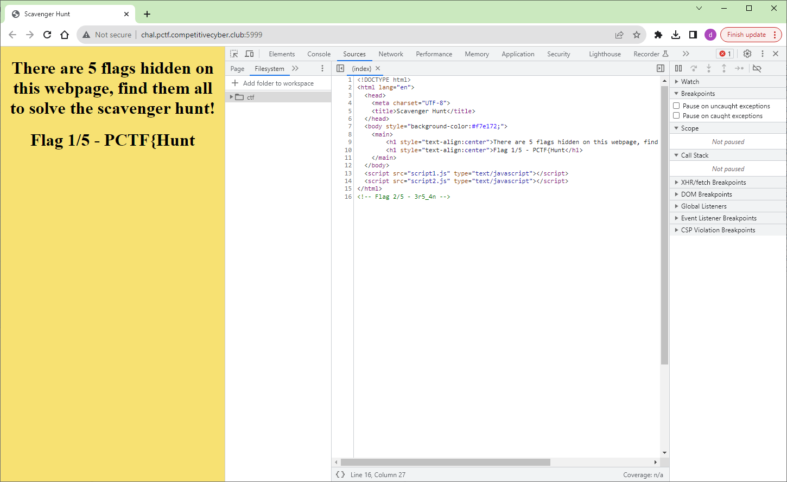
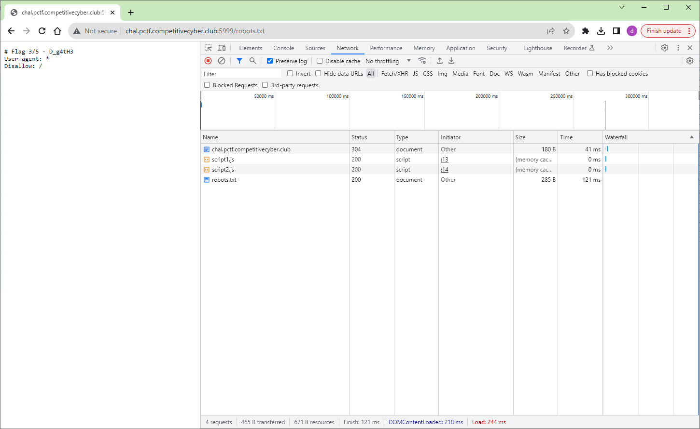
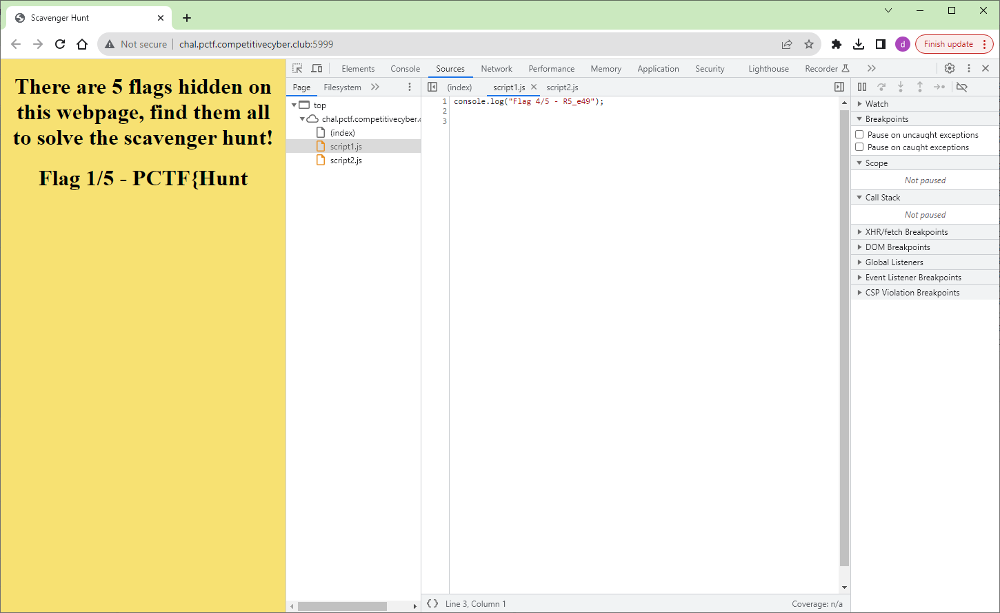
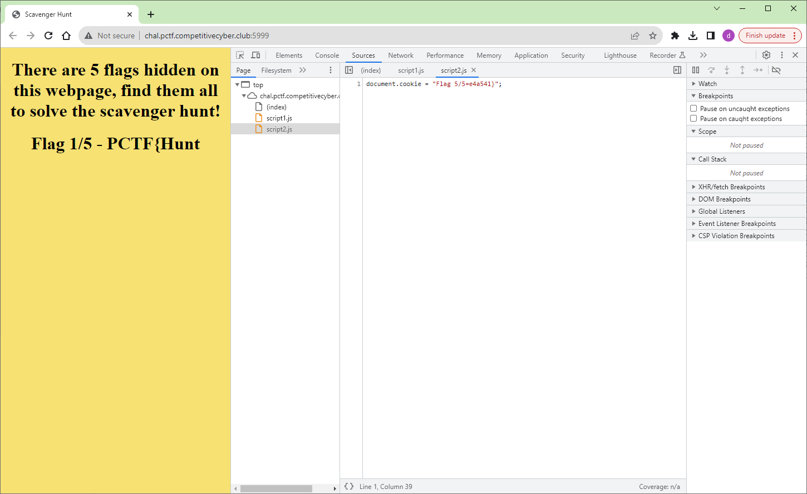

# Scavenger Hunt

## Files

## Solution
This really is just a scavenger hunt without requiring any hacking.  You just need to know some places to look and see if you can find a piece of the flag.

### First
It is right there on the front page.  Easy.

### Second
Now I open up the Chrome developer tools to examine the source code for the website and find the second flag.

### Third
This was actually the last one that I found.  The organizers announced a hint of "Beep Boop Bop".  Sounds like a robot right?  Well all sites (or they should) have a robots.txt file.  This file is used as an instruction to search engines how they should index for searching this website.  I don't really care too much about that aspect right now but this file does contain our third flag.

### Fourth
Still with the developer tools open we look as the JavaScript file script1.js and find our fourth flag.

### Fifth
Still with the developer tools open we look as the JavaScript file script2.js and find our fifth flag.

### Done
We have all 5 pieces of the flag.

Challenge Complete!
